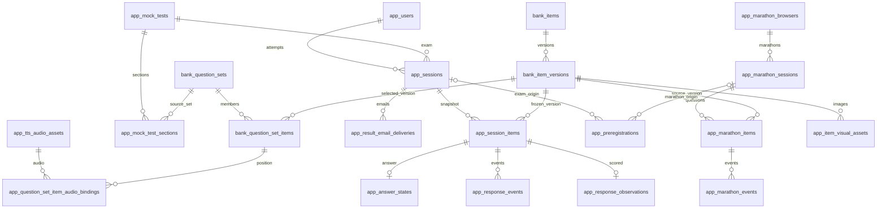

# 데이터베이스 구조

## 목차

- [전체 구조와 스키마 역할](#overview)
- [테이블 목록](#tables)
- [테이블 관계](#relations)
- [테이블별 전체 컬럼·제약](#details)
- [조회 뷰](#views)
- [인덱스·제약조건·삭제 규칙](#indexes)
- [주요 데이터 흐름](#flows)
- [마이그레이션과 문서 기준](#migrations)

기준: 2026-10-07 저장소 코드. 실제 운영 DB의 마이그레이션 적용 상태나 행 수를 조회한 결과는 아닙니다.

<a id="overview"></a>
## 전체 구조와 스키마 역할

PostgreSQL의 두 업무 스키마를 사용합니다.

| 스키마 | 역할 |
|---|---|
| topik_bank | 문제은행: 논리 문항, 문항 버전, 세트 구성, 외부 배포 이력 |
| topik_app | 서비스: 모의고사·응시·채점, 관리자, 음원·이미지, 이메일, 사전등록, 마라톤 |

Supabase Auth는 관리자 로그인, Supabase Storage는 파일 저장에 사용합니다. 이 문서는 저장소에 정의된 업무 스키마를 다루며 Supabase 내부 auth/storage 테이블의 전체 명세는 포함하지 않습니다. 파일 자체는 DB에 저장하지 않고 버킷·경로·URL과 자산 메타데이터를 저장합니다.

`topik_bank`는 서비스에서 읽기만 하는 스키마는 아닙니다. 관리자 문항 수정 기능은 새 item_versions를 만들고 question_set_items의 현재 버전 포인터를 갱신합니다.

<a id="tables"></a>
## 테이블 목록

### topik_bank

| 테이블 | 역할 |
|---|---|
| [topik_bank.deployment_run_sets](#topik-bank-deployment-run-sets) | 배포 실행에 포함된 세트별 결과. 세트 삭제 후에도 이력 보존이 가능한 구조입니다. |
| [topik_bank.deployment_runs](#topik-bank-deployment-runs) | 외부 문제은행 배포·이관 실행 단위의 상태와 생성·재사용 집계. |
| [topik_bank.item_versions](#topik-bank-item-versions) | 문항별 불변 버전, 문제 내용·정답·생성 모델·검수 상태·난이도 메타데이터. |
| [topik_bank.items](#topik-bank-items) | 원본 source_key로 식별하는 논리 문항. 내용은 item_versions에 저장합니다. |
| [topik_bank.question_set_items](#topik-bank-question-set-items) | 세트의 각 위치에 사용할 정확한 문항 ID·버전 포인터. |
| [topik_bank.question_sets](#topik-bank-question-sets) | 영역·생성 모델별 세트 정보와 발행 상태. 현재 구성은 question_set_items에 저장합니다. |
| [topik_bank.schema_migrations](#topik-bank-schema-migrations) | 적용한 마이그레이션 버전·시각 기록. topik_app에는 파일 체크섬도 저장합니다. |

### topik_app

| 테이블 | 역할 |
|---|---|
| [topik_app.admin_users](#topik-app-admin-users) | Supabase Auth 사용자와 서비스 활성 관리자 권한 연결. |
| [topik_app.answer_states](#topik-app-answer-states) | 일반 시험 문항별 현재 선택 답안과 선택 횟수·시각. |
| [topik_app.attempt_feedback](#topik-app-attempt-feedback) | 응시 세션별 별점·언어 및 결과 열람 해제 시각. |
| [topik_app.audio_playback_events](#topik-app-audio-playback-events) | 일반 시험 음원 재생 이벤트와 재생 회차. |
| [topik_app.email_send_ledger](#topik-app-email-send-ledger) | 결과·한도 경고 이메일의 발송량 예약·수락·실패 원장. |
| [topik_app.email_settings](#topik-app-email-settings) | 결과 이메일 발송 활성화 단일 설정 행(settings_id=1). |
| [topik_app.email_subscriptions](#topik-app-email-subscriptions) | 기존 세션 기반 이메일 구독 기록. 현재 사전등록·결과 발송 테이블과 별개입니다. |
| [topik_app.item_audio_bindings](#topik-app-item-audio-bindings) | 문항 버전별 기존 음원 연결. 세트 위치 음원이 없을 때 호환 조회에 사용. |
| [topik_app.item_visual_assets](#topik-app-item-visual-assets) | 문항 버전의 선택지(choice) 또는 지문 자료(material) 이미지 자산. |
| [topik_app.marathon_browsers](#topik-app-marathon-browsers) | 브라우저 토큰 해시, 누적 무료 응답 수, 사전등록 상태. |
| [topik_app.marathon_difficulties](#topik-app-marathon-difficulties) | 세트·문항별 운영자 난이도 재정의. null은 기본 난이도 사용. |
| [topik_app.marathon_difficulty_audits](#topik-app-marathon-difficulty-audits) | 난이도 변경 감사 이력. 변경 값 null도 기록합니다. |
| [topik_app.marathon_events](#topik-app-marathon-events) | 마라톤 활동·선택·음원 이벤트. request_id로 중복 방지. |
| [topik_app.marathon_items](#topik-app-marathon-items) | 발급 문제·정답·이미지·음원·정책 스냅샷 및 확정 답안. |
| [topik_app.marathon_sessions](#topik-app-marathon-sessions) | 브라우저별 영역의 진행 중 또는 재시작으로 중단된 마라톤 세션. |
| [topik_app.media_cleanup_jobs](#topik-app-media-cleanup-jobs) | 교체·삭제된 미디어 파일을 참조 여부 확인 후 정리하는 큐. |
| [topik_app.mock_test_sections](#topik-app-mock-test-sections) | 모의고사의 영역 순서와 문제은행 세트 연결. |
| [topik_app.mock_tests](#topik-app-mock-tests) | 사용자에게 노출하는 모의고사 제목·제한 시간·문항 수·공개 여부. |
| [topik_app.preregistration_deletion_audits](#topik-app-preregistration-deletion-audits) | 사전등록 삭제 관리자·등록 번호·시각의 감사 이력. |
| [topik_app.preregistrations](#topik-app-preregistrations) | 랜딩·시험 결과·마라톤 경로의 사전등록 및 동의 이력. |
| [topik_app.question_set_item_audio_bindings](#topik-app-question-set-item-audio-bindings) | 현재 세트 위치별 시험 트랙 음원 연결. 공통 문제는 같은 자산을 공유할 수 있습니다. |
| [topik_app.response_deletion_audits](#topik-app-response-deletion-audits) | 관리자 응답 삭제 작업의 범위와 삭제 건수 이력. |
| [topik_app.response_events](#topik-app-response-events) | 일반 시험의 노출·숨김·활동 시간·답안 선택 이벤트. client_event_id로 중복 방지. |
| [topik_app.response_observations](#topik-app-response-observations) | 제출 때 확정한 채점 결과와 응답 시간·누락·정책·능력치 관측값. |
| [topik_app.result_email_deliveries](#topik-app-result-email-deliveries) | 결과 이메일 요청·수락·실패 및 결과 링크 토큰 해시·만료·폐기. |
| [topik_app.schema_migrations](#topik-app-schema-migrations) | 적용한 마이그레이션 버전·시각 기록. topik_app에는 파일 체크섬도 저장합니다. |
| [topik_app.session_items](#topik-app-session-items) | 응시 시작 시 고정한 문항 버전·순서·배점·선택 정책 스냅샷. |
| [topik_app.sessions](#topik-app-sessions) | 일반 시험 진행·제출·중단 상태, 접근 토큰 해시와 점수·시간. |
| [topik_app.theta_estimation_runs](#topik-app-theta-estimation-runs) | 능력치(theta) 추정 실행의 알고리즘·버전·데이터 설명. |
| [topik_app.tts_audio_assets](#topik-app-tts-audio-assets) | 생성 음원 파일의 저장소 위치, 모델·음성·스타일·시험 트랙 스냅샷. |
| [topik_app.tts_generation_job_targets](#topik-app-tts-generation-job-targets) | 한 TTS 작업이 대상으로 하는 문항 버전과 세트 위치. |
| [topik_app.tts_generation_jobs](#topik-app-tts-generation-jobs) | TTS 생성 작업 큐와 재시도·리스·결과 음원. |
| [topik_app.users](#topik-app-users) | 일반 시험 익명 응시자. 현재 일반 세션 생성 시 새 사용자 행을 만듭니다. |
| [topik_app.visual_generation_jobs](#topik-app-visual-generation-jobs) | 이미지 생성 작업, 프롬프트 스냅샷, 결과·오류·재시도. |

<a id="relations"></a>
## 테이블 관계

다음 ERD는 주요 외래키 관계만 요약합니다. 전체 FK와 ON DELETE 동작은 각 테이블 아래 SQL에 기재합니다. 이름의 bank/app은 각각 topik_bank/topik_app입니다.



| 연결 | DB 보장·의미 |
|---|---|
| question_set_items → item_versions | item_id + item_version 복합 FK. 문항의 전체 최신 버전과 세트의 현재 선택 버전은 다를 수 있음 |
| session_items → item_versions | 응시 시점 문항 버전 보존. 이후 세트 수정으로 바뀌지 않음 |
| marathon_items → item_versions | 복합 FK와 별도로 question_json·정답·해설·미디어 ID 스냅샷 저장 |
| admin_users.auth_user_id → Supabase Auth | 고유 UUID로 연결하지만 스냅샷에는 auth.users FK 없음. 인증 코드가 검사 |
| marathon_browsers.registration_id → preregistrations | 논리 연결만 있음. 사전등록 삭제가 브라우저 등록 상태를 자동 해제하지 않음 |
| marathon_items.audio_asset_id / visual_asset_ids → 자산 | FK 없음. 서비스·정리 워커가 참조 확인 |
| media_cleanup_jobs.asset_id → 음원 또는 이미지 | 다형 참조로 FK 없음 |
| marathon_difficulties.item_id / updated_by | FK 없음. API가 세트 소속 및 관리자 인증 확인; set_id에는 FK 존재 |
| 사전등록 삭제·마라톤 난이도 감사 테이블의 ID | 일부 논리 ID만 보관하며 부모 삭제 연쇄 FK가 없음 |

<a id="details"></a>
## 테이블별 전체 컬럼·제약

- NULL 열의 `허용`은 NOT NULL/PK/IDENTITY 강제가 없다는 뜻입니다. CHECK의 조건부 제약은 별도 SQL을 확인합니다.
- 기본값 `없음`은 자동 생성 규칙이 없다는 의미입니다. UUID 상당수는 서비스 코드가 생성하므로 DB 기본값으로 추정하지 않습니다.
- GENERATED 식과 IDENTITY는 기본값 칸에 그대로 표시합니다. timestamptz는 시간대가 있는 시각, timestamp와 API 표시는 구분합니다.
- PK/UNIQUE/FK/CHECK는 테이블 정의에 붙는 제약 조각으로, 인덱스는 CREATE INDEX 문으로 표시합니다. 제약 조각만 단독 실행할 수는 없습니다. ON DELETE가 없으면 PostgreSQL 기본 NO ACTION입니다.

<a id="topik-bank-deployment-run-sets"></a>
### topik_bank.deployment_run_sets

배포 실행에 포함된 세트별 결과. 세트 삭제 후에도 이력 보존이 가능한 구조입니다.

| 컬럼 | PostgreSQL 자료형 | NULL | 기본값·생성 규칙 | 의미 |
|---|---|---|---|---|
| `run_id` | `uuid` | 불가 | 없음 | 배포 실행 ID |
| `set_id` | `uuid` | 불가 | 없음 | 세트 ID |
| `set_sequence` | `integer` | 불가 | 없음 | 세트 순번 |
| `source_snapshot_hash` | `character(64)` | 불가 | 없음 | 원본 스냅샷 해시 |
| `status` | `text` | 불가 | 없음 | 처리 상태(하단 CHECK 참조) |
| `detail` | `text` | 불가 | `''::text` | 상세 설명 |

**키·참조·검증 제약**

```sql
CONSTRAINT deployment_run_sets_set_sequence_check CHECK ((set_sequence >= 1));
CONSTRAINT deployment_run_sets_status_check CHECK ((status = ANY (ARRAY['running'::text, 'succeeded'::text, 'rolled_back'::text, 'outcome_unknown'::text])));
CONSTRAINT deployment_run_sets_pkey PRIMARY KEY (run_id, set_id);
CONSTRAINT deployment_run_sets_run_id_fkey FOREIGN KEY (run_id) REFERENCES topik_bank.deployment_runs(run_id) ON DELETE CASCADE;
```

<a id="topik-bank-deployment-runs"></a>
### topik_bank.deployment_runs

외부 문제은행 배포·이관 실행 단위의 상태와 생성·재사용 집계.

| 컬럼 | PostgreSQL 자료형 | NULL | 기본값·생성 규칙 | 의미 |
|---|---|---|---|---|
| `run_id` | `uuid` | 불가 | 없음 | 배포 실행 ID |
| `target_fingerprint` | `character(64)` | 불가 | 없음 | 배포 대상 식별 지문 |
| `target_label` | `text` | 불가 | 없음 | 배포 대상 표시명 |
| `source_snapshot_hash` | `character(64)` | 불가 | 없음 | 원본 스냅샷 해시 |
| `status` | `text` | 불가 | 없음 | 처리 상태(하단 CHECK 참조) |
| `requested_set_count` | `integer` | 불가 | 없음 | 요청 세트 수 |
| `transferred_set_count` | `integer` | 불가 | `0` | 전송 세트 수 |
| `reused_set_count` | `integer` | 불가 | `0` | 재사용 세트 수 |
| `created_row_count` | `integer` | 불가 | `0` | 생성 행 수 |
| `reused_row_count` | `integer` | 불가 | `0` | 재사용 행 수 |
| `error_message` | `text` | 불가 | `''::text` | 오류 메시지 |
| `started_at` | `timestamp with time zone` | 불가 | `CURRENT_TIMESTAMP` | 시작 시각 |
| `completed_at` | `timestamp with time zone` | 허용 | 없음 | 완료 시각 |

**키·참조·검증 제약**

```sql
CONSTRAINT deployment_runs_created_row_count_check CHECK ((created_row_count >= 0));
CONSTRAINT deployment_runs_requested_set_count_check CHECK ((requested_set_count >= 1));
CONSTRAINT deployment_runs_reused_row_count_check CHECK ((reused_row_count >= 0));
CONSTRAINT deployment_runs_reused_set_count_check CHECK ((reused_set_count >= 0));
CONSTRAINT deployment_runs_status_check CHECK ((status = ANY (ARRAY['running'::text, 'succeeded'::text, 'rolled_back'::text, 'outcome_unknown'::text])));
CONSTRAINT deployment_runs_transferred_set_count_check CHECK ((transferred_set_count >= 0));
CONSTRAINT deployment_runs_pkey PRIMARY KEY (run_id);
```

**명시적 인덱스**

```sql
CREATE INDEX deployment_runs_started_idx ON topik_bank.deployment_runs USING btree (started_at DESC);
```

<a id="topik-bank-item-versions"></a>
### topik_bank.item_versions

문항별 불변 버전, 문제 내용·정답·생성 모델·검수 상태·난이도 메타데이터.

| 컬럼 | PostgreSQL 자료형 | NULL | 기본값·생성 규칙 | 의미 |
|---|---|---|---|---|
| `item_id` | `uuid` | 불가 | 없음 | 논리 문항 ID |
| `item_version` | `integer` | 불가 | 없음 | 문항 버전 |
| `section` | `text` | 불가 | 없음 | 읽기·듣기·쓰기 영역 |
| `item_type` | `text` | 불가 | 없음 | 문항 유형 |
| `primary_skill` | `text` | 불가 | 없음 | 주요 평가 능력 |
| `target_level` | `smallint` | 불가 | 없음 | 목표 급수 |
| `predicted_difficulty` | `double precision` | 불가 | 없음 | 예측 난이도 |
| `irt_difficulty` | `double precision` | 허용 | 없음 | IRT 난이도 |
| `irt_discrimination` | `double precision` | 허용 | 없음 | IRT 변별도 |
| `stem_length` | `integer` | 불가 | 없음 | 본문 길이 |
| `choice_count` | `integer` | 불가 | 없음 | 선택지 수 |
| `generator_provider` | `text` | 불가 | 없음 | 생성 모델 공급자 |
| `generator_model` | `text` | 불가 | 없음 | 생성 모델 이름 |
| `generator_version` | `text` | 불가 | 없음 | 생성 모델 정확한 버전 |
| `prompt_version` | `character(64)` | 불가 | 없음 | 프롬프트 버전 해시 |
| `review_status` | `text` | 불가 | `'reviewed'::text` | 검수 상태 |
| `stem` | `text` | 불가 | 없음 | 문제 본문 |
| `choices` | `jsonb` | 불가 | 없음 | 보기 JSON 배열 |
| `correct_answer` | `smallint` | 허용 | 없음 | 정답 번호 |
| `explanation` | `text` | 불가 | `''::text` | 정답 해설 |
| `content_json` | `jsonb` | 불가 | 없음 | 원본 문항 구조 JSON |
| `source_provenance` | `jsonb` | 불가 | 없음 | 원본 추적 메타데이터 JSON |
| `content_hash` | `character(64)` | 불가 | 없음 | 문항 내용 해시 |
| `created_at` | `timestamp with time zone` | 불가 | `CURRENT_TIMESTAMP` | 생성 시각 |
| `type_slot` | `smallint` | 불가 | 없음 | 유형 슬롯(1~50) |

**키·참조·검증 제약**

```sql
CONSTRAINT item_versions_choice_count_check CHECK ((choice_count >= 0));
CONSTRAINT item_versions_irt_discrimination_check CHECK (((irt_discrimination IS NULL) OR (irt_discrimination > (0)::double precision)));
CONSTRAINT item_versions_item_version_check CHECK ((item_version >= 1));
CONSTRAINT item_versions_predicted_difficulty_check CHECK (((predicted_difficulty >= ('-3.0'::numeric)::double precision) AND (predicted_difficulty <= (3.0)::double precision)));
CONSTRAINT item_versions_primary_skill_check CHECK ((btrim(primary_skill) <> ''::text));
CONSTRAINT item_versions_review_status_check CHECK ((review_status = ANY (ARRAY['reviewed'::text, 'pilot'::text, 'active'::text, 'retired'::text])));
CONSTRAINT item_versions_section_check CHECK ((section = ANY (ARRAY['reading'::text, 'listening'::text, 'writing'::text])));
CONSTRAINT item_versions_stem_length_check CHECK ((stem_length >= 0));
CONSTRAINT item_versions_target_level_check CHECK (((target_level >= 1) AND (target_level <= 6)));
CONSTRAINT item_versions_type_slot_check CHECK (((type_slot >= 1) AND (type_slot <= 50)));
CONSTRAINT item_versions_item_id_content_hash_key UNIQUE (item_id, content_hash);
CONSTRAINT item_versions_pkey PRIMARY KEY (item_id, item_version);
CONSTRAINT item_versions_item_id_fkey FOREIGN KEY (item_id) REFERENCES topik_bank.items(item_id);
```

**명시적 인덱스**

```sql
CREATE INDEX item_versions_generator_idx ON topik_bank.item_versions USING btree (generator_provider, generator_version);
CREATE INDEX item_versions_lookup_idx ON topik_bank.item_versions USING btree (section, item_type, target_level, review_status);
CREATE INDEX item_versions_slot_idx ON topik_bank.item_versions USING btree (section, generator_version, type_slot);
```

<a id="topik-bank-items"></a>
### topik_bank.items

원본 source_key로 식별하는 논리 문항. 내용은 item_versions에 저장합니다.

| 컬럼 | PostgreSQL 자료형 | NULL | 기본값·생성 규칙 | 의미 |
|---|---|---|---|---|
| `item_id` | `uuid` | 불가 | 없음 | 논리 문항 ID |
| `source_key` | `text` | 불가 | 없음 | 원본 문항 식별 키 |
| `created_at` | `timestamp with time zone` | 불가 | `CURRENT_TIMESTAMP` | 생성 시각 |

**키·참조·검증 제약**

```sql
CONSTRAINT items_pkey PRIMARY KEY (item_id);
CONSTRAINT items_source_key_key UNIQUE (source_key);
```

<a id="topik-bank-question-set-items"></a>
### topik_bank.question_set_items

세트의 각 위치에 사용할 정확한 문항 ID·버전 포인터.

| 컬럼 | PostgreSQL 자료형 | NULL | 기본값·생성 규칙 | 의미 |
|---|---|---|---|---|
| `set_id` | `uuid` | 불가 | 없음 | 세트 ID |
| `position` | `smallint` | 불가 | 없음 | 세트 내 위치 |
| `item_id` | `uuid` | 불가 | 없음 | 논리 문항 ID |
| `item_version` | `integer` | 불가 | 없음 | 문항 버전 |

**키·참조·검증 제약**

```sql
CONSTRAINT question_set_items_position_check CHECK (((position >= 1) AND (position <= 50)));
CONSTRAINT question_set_items_pkey PRIMARY KEY (set_id, position);
CONSTRAINT question_set_items_set_id_item_id_key UNIQUE (set_id, item_id);
CONSTRAINT question_set_items_item_id_item_version_fkey FOREIGN KEY (item_id, item_version) REFERENCES topik_bank.item_versions(item_id, item_version);
CONSTRAINT question_set_items_set_id_fkey FOREIGN KEY (set_id) REFERENCES topik_bank.question_sets(set_id);
```

<a id="topik-bank-question-sets"></a>
### topik_bank.question_sets

영역·생성 모델별 세트 정보와 발행 상태. 현재 구성은 question_set_items에 저장합니다.

| 컬럼 | PostgreSQL 자료형 | NULL | 기본값·생성 규칙 | 의미 |
|---|---|---|---|---|
| `set_id` | `uuid` | 불가 | 없음 | 세트 ID |
| `section` | `text` | 불가 | 없음 | 읽기·듣기·쓰기 영역 |
| `generator_provider` | `text` | 불가 | 없음 | 생성 모델 공급자 |
| `generator_model` | `text` | 불가 | 없음 | 생성 모델 이름 |
| `generator_version` | `text` | 불가 | 없음 | 생성 모델 정확한 버전 |
| `created_at` | `timestamp with time zone` | 불가 | `CURRENT_TIMESTAMP` | 생성 시각 |
| `set_sequence` | `integer` | 불가 | 없음 | 세트 순번 |
| `review_status` | `text` | 불가 | `'reviewed'::text` | 검수 상태 |
| `default_target_level` | `smallint` | 불가 | 없음 | 세트 기본 목표 급수 |
| `default_predicted_difficulty` | `double precision` | 불가 | 없음 | 세트 기본 예측 난이도 |
| `set_fingerprint` | `character(64)` | 불가 | 없음 | 현재 세트 구성 지문 |
| `published_at` | `timestamp with time zone` | 불가 | `CURRENT_TIMESTAMP` | 발행 시각 |

**키·참조·검증 제약**

```sql
CONSTRAINT question_sets_default_predicted_difficulty_check CHECK (((default_predicted_difficulty >= ('-3.0'::numeric)::double precision) AND (default_predicted_difficulty <= (3.0)::double precision)));
CONSTRAINT question_sets_default_target_level_check CHECK (((default_target_level >= 1) AND (default_target_level <= 6)));
CONSTRAINT question_sets_review_status_check CHECK ((review_status = ANY (ARRAY['reviewed'::text, 'pilot'::text, 'active'::text, 'retired'::text])));
CONSTRAINT question_sets_section_check CHECK ((section = ANY (ARRAY['reading'::text, 'listening'::text, 'writing'::text])));
CONSTRAINT question_sets_set_sequence_check CHECK ((set_sequence >= 1));
CONSTRAINT question_sets_identity_sequence_key UNIQUE (section, generator_provider, generator_model, generator_version, set_sequence);
CONSTRAINT question_sets_pkey PRIMARY KEY (set_id);
```

<a id="topik-bank-schema-migrations"></a>
### topik_bank.schema_migrations

적용한 마이그레이션 버전·시각 기록. topik_app에는 파일 체크섬도 저장합니다.

| 컬럼 | PostgreSQL 자료형 | NULL | 기본값·생성 규칙 | 의미 |
|---|---|---|---|---|
| `version` | `text` | 불가 | 없음 | 마이그레이션 버전 |
| `applied_at` | `timestamp with time zone` | 불가 | `CURRENT_TIMESTAMP` | 적용 시각 |

**키·참조·검증 제약**

```sql
CONSTRAINT schema_migrations_pkey PRIMARY KEY (version);
```

<a id="topik-app-admin-users"></a>
### topik_app.admin_users

Supabase Auth 사용자와 서비스 활성 관리자 권한 연결.

| 컬럼 | PostgreSQL 자료형 | NULL | 기본값·생성 규칙 | 의미 |
|---|---|---|---|---|
| `admin_user_id` | `uuid` | 불가 | 없음 | 서비스 관리자 ID |
| `auth_user_id` | `uuid` | 불가 | 없음 | Supabase Auth 사용자 ID |
| `email_normalized` | `text` | 불가 | 없음 | 정규화 이메일 |
| `is_active` | `boolean` | 불가 | `true` | 활성 관리자 여부 |
| `created_at` | `timestamp with time zone` | 불가 | `CURRENT_TIMESTAMP` | 생성 시각 |
| `updated_at` | `timestamp with time zone` | 불가 | `CURRENT_TIMESTAMP` | 수정 시각 |

**키·참조·검증 제약**

```sql
CONSTRAINT admin_users_auth_user_id_key UNIQUE (auth_user_id);
CONSTRAINT admin_users_email_normalized_key UNIQUE (email_normalized);
CONSTRAINT admin_users_pkey PRIMARY KEY (admin_user_id);
```

<a id="topik-app-answer-states"></a>
### topik_app.answer_states

일반 시험 문항별 현재 선택 답안과 선택 횟수·시각.

| 컬럼 | PostgreSQL 자료형 | NULL | 기본값·생성 규칙 | 의미 |
|---|---|---|---|---|
| `session_id` | `uuid` | 불가 | 없음 | 응시 세션 ID |
| `item_order` | `smallint` | 불가 | 없음 | 세션 내 문항 순서 |
| `selected_option` | `smallint` | 불가 | 없음 | 선택한 보기 번호 |
| `first_selected_at` | `timestamp with time zone` | 불가 | `CURRENT_TIMESTAMP` | 최초 선택 시각 |
| `final_selected_at` | `timestamp with time zone` | 불가 | `CURRENT_TIMESTAMP` | 최종 선택 시각 |
| `selection_count` | `integer` | 불가 | `1` | 답안 선택 횟수 |

**키·참조·검증 제약**

```sql
CONSTRAINT answer_states_selected_option_check CHECK (((selected_option >= 1) AND (selected_option <= 4)));
CONSTRAINT answer_states_selection_count_check CHECK ((selection_count > 0));
CONSTRAINT answer_states_pkey PRIMARY KEY (session_id, item_order);
CONSTRAINT answer_states_session_id_item_order_fkey FOREIGN KEY (session_id, item_order) REFERENCES topik_app.session_items(session_id, item_order) ON DELETE CASCADE;
```

<a id="topik-app-attempt-feedback"></a>
### topik_app.attempt_feedback

응시 세션별 별점·언어 및 결과 열람 해제 시각.

| 컬럼 | PostgreSQL 자료형 | NULL | 기본값·생성 규칙 | 의미 |
|---|---|---|---|---|
| `session_id` | `uuid` | 불가 | 없음 | 응시 세션 ID |
| `rating` | `smallint` | 불가 | 없음 | 별점 1~5 |
| `locale` | `text` | 불가 | 없음 | 언어 코드 |
| `created_at` | `timestamp with time zone` | 불가 | `CURRENT_TIMESTAMP` | 생성 시각 |
| `updated_at` | `timestamp with time zone` | 불가 | `CURRENT_TIMESTAMP` | 수정 시각 |

**키·참조·검증 제약**

```sql
CONSTRAINT attempt_feedback_locale_check CHECK ((locale = ANY (ARRAY['ko'::text, 'en'::text])));
CONSTRAINT attempt_feedback_rating_check CHECK (((rating >= 1) AND (rating <= 5)));
CONSTRAINT attempt_feedback_pkey PRIMARY KEY (session_id);
CONSTRAINT attempt_feedback_session_id_fkey FOREIGN KEY (session_id) REFERENCES topik_app.sessions(session_id) ON DELETE CASCADE;
```

<a id="topik-app-audio-playback-events"></a>
### topik_app.audio_playback_events

일반 시험 음원 재생 이벤트와 재생 회차.

| 컬럼 | PostgreSQL 자료형 | NULL | 기본값·생성 규칙 | 의미 |
|---|---|---|---|---|
| `playback_event_id` | `uuid` | 불가 | 없음 | 재생 이벤트 ID |
| `client_play_id` | `uuid` | 불가 | 없음 | 클라이언트 재생 ID |
| `session_id` | `uuid` | 불가 | 없음 | 응시 세션 ID |
| `audio_asset_id` | `uuid` | 불가 | 없음 | 음원 자산 ID |
| `event_type` | `text` | 불가 | 없음 | 이벤트 종류 |
| `play_number` | `smallint` | 불가 | 없음 | 재생 회차 |
| `created_at` | `timestamp with time zone` | 불가 | `CURRENT_TIMESTAMP` | 생성 시각 |

**키·참조·검증 제약**

```sql
CONSTRAINT audio_playback_events_event_type_check CHECK ((event_type = ANY (ARRAY['started'::text, 'completed'::text, 'interrupted'::text])));
CONSTRAINT audio_playback_events_play_number_check CHECK ((play_number > 0));
CONSTRAINT audio_playback_events_client_play_id_event_type_key UNIQUE (client_play_id, event_type);
CONSTRAINT audio_playback_events_pkey PRIMARY KEY (playback_event_id);
CONSTRAINT audio_playback_events_audio_asset_id_fkey FOREIGN KEY (audio_asset_id) REFERENCES topik_app.tts_audio_assets(audio_asset_id);
CONSTRAINT audio_playback_events_session_id_fkey FOREIGN KEY (session_id) REFERENCES topik_app.sessions(session_id) ON DELETE CASCADE;
```

**명시적 인덱스**

```sql
CREATE INDEX audio_playback_session_asset_idx ON topik_app.audio_playback_events USING btree (session_id, audio_asset_id, created_at);
```

<a id="topik-app-email-send-ledger"></a>
### topik_app.email_send_ledger

결과·한도 경고 이메일의 발송량 예약·수락·실패 원장.

| 컬럼 | PostgreSQL 자료형 | NULL | 기본값·생성 규칙 | 의미 |
|---|---|---|---|---|
| `send_id` | `UUID` | 불가 | 없음 | 발송 원장 ID |
| `kind` | `TEXT` | 불가 | 없음 | result 또는 quota_warning |
| `result_delivery_id` | `UUID` | 허용 | 없음 | 결과 발송 연결 ID |
| `trigger_delivery_id` | `UUID` | 허용 | 없음 | 경고를 유발한 결과 발송 ID |
| `session_id` | `UUID` | 허용 | 없음 | 응시 세션 ID |
| `billing_cycle_start` | `DATE` | 불가 | 없음 | KST 과금 주기 시작일 |
| `recipient_count` | `SMALLINT` | 불가 | 없음 | 수신자 수 |
| `status` | `TEXT` | 불가 | `'pending'` | 처리 상태(하단 CHECK 참조) |
| `provider_message_ids` | `TEXT[]` | 불가 | `'{}'` | 업체 메시지 ID 배열 |
| `failure_code` | `TEXT` | 허용 | 없음 | 실패 코드 |
| `payload_json` | `JSONB` | 불가 | `'{}'::jsonb` | 작업 요청 페이로드 JSON |
| `attempts` | `SMALLINT` | 불가 | `0` | 작업 시도 횟수 |
| `next_attempt_at` | `TIMESTAMPTZ` | 불가 | `CURRENT_TIMESTAMP` | 다음 시도 시각 |
| `lease_expires_at` | `TIMESTAMPTZ` | 허용 | 없음 | 워커 점유 만료 시각 |
| `requested_at` | `TIMESTAMPTZ` | 불가 | `CURRENT_TIMESTAMP` | 요청 시각 |
| `accepted_at` | `TIMESTAMPTZ` | 허용 | 없음 | 업체 수락 시각 |
| `failed_at` | `TIMESTAMPTZ` | 허용 | 없음 | 실패 시각 |

**키·참조·검증 제약**

```sql
CHECK ( (kind = 'result' AND recipient_count = 1) OR (kind = 'quota_warning' AND recipient_count = 2) );
PRIMARY KEY (send_id);
CHECK (kind IN ('result', 'quota_warning'));
UNIQUE (result_delivery_id);
FOREIGN KEY (result_delivery_id) REFERENCES topik_app.result_email_deliveries(delivery_id) ON DELETE SET NULL;
FOREIGN KEY (trigger_delivery_id) REFERENCES topik_app.result_email_deliveries(delivery_id) ON DELETE SET NULL;
FOREIGN KEY (session_id) REFERENCES topik_app.sessions(session_id) ON DELETE SET NULL;
CHECK (recipient_count > 0);
CHECK (status IN ('pending', 'processing', 'accepted', 'failed'));
CHECK (attempts >= 0);
```

**명시적 인덱스**

```sql
CREATE INDEX email_send_ledger_cycle_status_idx ON topik_app.email_send_ledger(billing_cycle_start, status, requested_at);
CREATE INDEX email_send_ledger_session_window_idx ON topik_app.email_send_ledger(session_id, requested_at DESC) WHERE kind = 'result' AND status IN ('pending', 'processing', 'accepted');
CREATE UNIQUE INDEX email_send_ledger_cycle_warning_idx ON topik_app.email_send_ledger(billing_cycle_start) WHERE kind = 'quota_warning' AND status IN ('pending', 'processing', 'accepted');
```

<a id="topik-app-email-settings"></a>
### topik_app.email_settings

결과 이메일 발송 활성화 단일 설정 행(settings_id=1).

| 컬럼 | PostgreSQL 자료형 | NULL | 기본값·생성 규칙 | 의미 |
|---|---|---|---|---|
| `settings_id` | `SMALLINT` | 불가 | `1` | 단일 설정 행 ID(1) |
| `result_email_enabled` | `BOOLEAN` | 불가 | `TRUE` | 결과 이메일 발송 활성화 |
| `updated_by` | `UUID` | 허용 | 없음 | 변경 관리자 ID |
| `updated_at` | `TIMESTAMPTZ` | 불가 | `CURRENT_TIMESTAMP` | 수정 시각 |

**키·참조·검증 제약**

```sql
PRIMARY KEY (settings_id);
CHECK (settings_id = 1);
FOREIGN KEY (updated_by) REFERENCES topik_app.admin_users(admin_user_id) ON DELETE SET NULL;
```

<a id="topik-app-email-subscriptions"></a>
### topik_app.email_subscriptions

기존 세션 기반 이메일 구독 기록. 현재 사전등록·결과 발송 테이블과 별개입니다.

| 컬럼 | PostgreSQL 자료형 | NULL | 기본값·생성 규칙 | 의미 |
|---|---|---|---|---|
| `subscription_id` | `uuid` | 불가 | 없음 | 기존 이메일 구독 ID |
| `session_id` | `uuid` | 허용 | 없음 | 응시 세션 ID |
| `email_normalized` | `text` | 불가 | 없음 | 정규화 이메일 |
| `email_original` | `text` | 불가 | 없음 | 입력 이메일 |
| `locale` | `text` | 불가 | 없음 | 언어 코드 |
| `consented_at` | `timestamp with time zone` | 불가 | `CURRENT_TIMESTAMP` | 동의 시각 |
| `unsubscribed_at` | `timestamp with time zone` | 허용 | 없음 | 구독 해지 시각 |
| `source` | `text` | 불가 | `'topik_mock_result'::text` | 유입 또는 생성 출처 |

**키·참조·검증 제약**

```sql
CONSTRAINT email_subscriptions_locale_check CHECK ((locale = ANY (ARRAY['ko'::text, 'en'::text])));
CONSTRAINT email_subscriptions_email_normalized_key UNIQUE (email_normalized);
CONSTRAINT email_subscriptions_pkey PRIMARY KEY (subscription_id);
CONSTRAINT email_subscriptions_session_id_fkey FOREIGN KEY (session_id) REFERENCES topik_app.sessions(session_id) ON DELETE SET NULL;
```

<a id="topik-app-item-audio-bindings"></a>
### topik_app.item_audio_bindings

문항 버전별 기존 음원 연결. 세트 위치 음원이 없을 때 호환 조회에 사용.

| 컬럼 | PostgreSQL 자료형 | NULL | 기본값·생성 규칙 | 의미 |
|---|---|---|---|---|
| `item_id` | `uuid` | 불가 | 없음 | 논리 문항 ID |
| `item_version` | `integer` | 불가 | 없음 | 문항 버전 |
| `audio_asset_id` | `uuid` | 불가 | 없음 | 음원 자산 ID |
| `source_hash` | `character(64)` | 불가 | 없음 | 생성 입력 해시 |
| `is_current` | `boolean` | 불가 | `true` | 현재 사용하는 연결·자산 여부 |
| `created_at` | `timestamp with time zone` | 불가 | `CURRENT_TIMESTAMP` | 생성 시각 |

**키·참조·검증 제약**

```sql
CONSTRAINT item_audio_bindings_item_version_check CHECK ((item_version > 0));
CONSTRAINT item_audio_bindings_pkey PRIMARY KEY (item_id, item_version, audio_asset_id);
CONSTRAINT item_audio_bindings_audio_asset_id_fkey FOREIGN KEY (audio_asset_id) REFERENCES topik_app.tts_audio_assets(audio_asset_id);
CONSTRAINT item_audio_bindings_item_id_item_version_fkey FOREIGN KEY (item_id, item_version) REFERENCES topik_bank.item_versions(item_id, item_version);
```

**명시적 인덱스**

```sql
CREATE UNIQUE INDEX item_audio_current_idx ON topik_app.item_audio_bindings USING btree (item_id, item_version) WHERE is_current;
```

<a id="topik-app-item-visual-assets"></a>
### topik_app.item_visual_assets

문항 버전의 선택지(choice) 또는 지문 자료(material) 이미지 자산.

| 컬럼 | PostgreSQL 자료형 | NULL | 기본값·생성 규칙 | 의미 |
|---|---|---|---|---|
| `visual_asset_id` | `uuid` | 불가 | 없음 | 이미지 자산 ID |
| `item_id` | `uuid` | 불가 | 없음 | 논리 문항 ID |
| `item_version` | `integer` | 불가 | 없음 | 문항 버전 |
| `option_number` | `smallint` | 불가 | 없음 | 선택지 번호(material은 1) |
| `storage_bucket` | `text` | 불가 | 없음 | 저장소 버킷 이름 |
| `storage_path` | `text` | 불가 | 없음 | 버킷 내부 파일 경로 |
| `storage_url` | `text` | 불가 | 없음 | 저장된 파일 URL |
| `mime_type` | `text` | 불가 | 없음 | 파일 MIME 타입 |
| `byte_size` | `integer` | 불가 | 없음 | 파일 크기(byte) |
| `created_by` | `uuid` | 허용 | 없음 | 생성한 관리자 ID |
| `is_current` | `boolean` | 불가 | `true` | 현재 사용하는 연결·자산 여부 |
| `created_at` | `timestamp with time zone` | 불가 | `CURRENT_TIMESTAMP` | 생성 시각 |
| `visual_role` | `text` | 불가 | `'choice'::text` | choice 또는 material |

**키·참조·검증 제약**

```sql
CONSTRAINT item_visual_assets_byte_size_check CHECK ((byte_size > 0));
CONSTRAINT item_visual_assets_item_version_check CHECK ((item_version > 0));
CONSTRAINT item_visual_assets_option_number_check CHECK (((option_number >= 1) AND (option_number <= 4)));
CONSTRAINT item_visual_assets_visual_role_check CHECK ((visual_role = ANY (ARRAY['choice'::text, 'material'::text])));
CONSTRAINT item_visual_assets_pkey PRIMARY KEY (visual_asset_id);
CONSTRAINT item_visual_assets_created_by_fkey FOREIGN KEY (created_by) REFERENCES topik_app.admin_users(admin_user_id);
CONSTRAINT item_visual_assets_item_id_item_version_fkey FOREIGN KEY (item_id, item_version) REFERENCES topik_bank.item_versions(item_id, item_version);
```

**명시적 인덱스**

```sql
CREATE UNIQUE INDEX item_visual_current_idx ON topik_app.item_visual_assets USING btree (item_id, item_version, visual_role, option_number) WHERE is_current;
```

<a id="topik-app-marathon-browsers"></a>
### topik_app.marathon_browsers

브라우저 토큰 해시, 누적 무료 응답 수, 사전등록 상태.

| 컬럼 | PostgreSQL 자료형 | NULL | 기본값·생성 규칙 | 의미 |
|---|---|---|---|---|
| `browser_id` | `UUID` | 불가 | 없음 | 브라우저 ID |
| `token_hash` | `CHAR(64)` | 불가 | 없음 | 브라우저 토큰 SHA-256 해시 |
| `answered_count` | `INTEGER` | 불가 | `0` | 브라우저 누적 제출 문항 수 |
| `registered_at` | `TIMESTAMPTZ` | 허용 | 없음 | 브라우저 사전등록 완료 시각 |
| `registration_id` | `TEXT` | 허용 | 없음 | 사전등록 번호 문자열 |
| `created_at` | `TIMESTAMPTZ` | 불가 | `CURRENT_TIMESTAMP` | 생성 시각 |

**키·참조·검증 제약**

```sql
PRIMARY KEY (browser_id);
UNIQUE (token_hash);
CHECK (answered_count >= 0);
```

<a id="topik-app-marathon-difficulties"></a>
### topik_app.marathon_difficulties

세트·문항별 운영자 난이도 재정의. null은 기본 난이도 사용.

| 컬럼 | PostgreSQL 자료형 | NULL | 기본값·생성 규칙 | 의미 |
|---|---|---|---|---|
| `set_id` | `UUID` | 불가 | 없음 | 세트 ID |
| `item_id` | `UUID` | 불가 | 없음 | 논리 문항 ID |
| `difficulty` | `SMALLINT` | 허용 | 없음 | 적용·재정의 난이도 1~3 |
| `updated_by` | `UUID` | 불가 | 없음 | 변경 관리자 ID |
| `updated_at` | `TIMESTAMPTZ` | 불가 | `CURRENT_TIMESTAMP` | 수정 시각 |

**키·참조·검증 제약**

```sql
PRIMARY KEY (set_id,item_id);
FOREIGN KEY (set_id) REFERENCES topik_bank.question_sets(set_id);
CHECK (difficulty BETWEEN 1 AND 3);
```

<a id="topik-app-marathon-difficulty-audits"></a>
### topik_app.marathon_difficulty_audits

난이도 변경 감사 이력. 변경 값 null도 기록합니다.

| 컬럼 | PostgreSQL 자료형 | NULL | 기본값·생성 규칙 | 의미 |
|---|---|---|---|---|
| `audit_id` | `BIGINT` | 불가 | `GENERATED ALWAYS AS IDENTITY` | 자동 증가 감사 ID |
| `set_id` | `UUID` | 불가 | 없음 | 세트 ID |
| `item_id` | `UUID` | 불가 | 없음 | 논리 문항 ID |
| `difficulty` | `SMALLINT` | 허용 | 없음 | 적용·재정의 난이도 1~3 |
| `updated_by` | `UUID` | 불가 | 없음 | 변경 관리자 ID |
| `updated_at` | `TIMESTAMPTZ` | 불가 | `CURRENT_TIMESTAMP` | 수정 시각 |

**키·참조·검증 제약**

```sql
PRIMARY KEY (audit_id);
CHECK (difficulty BETWEEN 1 AND 3);
```

<a id="topik-app-marathon-events"></a>
### topik_app.marathon_events

마라톤 활동·선택·음원 이벤트. request_id로 중복 방지.

| 컬럼 | PostgreSQL 자료형 | NULL | 기본값·생성 규칙 | 의미 |
|---|---|---|---|---|
| `request_id` | `UUID` | 불가 | 없음 | 요청 멱등 UUID |
| `session_id` | `UUID` | 불가 | 없음 | 응시 세션 ID |
| `item_order` | `INTEGER` | 불가 | 없음 | 세션 내 문항 순서 |
| `event_type` | `TEXT` | 불가 | 없음 | 이벤트 종류 |
| `selected_option` | `SMALLINT` | 허용 | 없음 | 선택한 보기 번호 |
| `duration_ms` | `INTEGER` | 불가 | `0` | 지속 시간(ms) |
| `created_at` | `TIMESTAMPTZ` | 불가 | `CURRENT_TIMESTAMP` | 생성 시각 |

**키·참조·검증 제약**

```sql
FOREIGN KEY (session_id,item_order) REFERENCES topik_app.marathon_items(session_id,item_order);
PRIMARY KEY (request_id);
CHECK (event_type IN ('presented','hidden','heartbeat','selection','prepared','started','completed','interrupted'));
CHECK (selected_option BETWEEN 1 AND 4);
CHECK (duration_ms BETWEEN 0 AND 60000);
```

<a id="topik-app-marathon-items"></a>
### topik_app.marathon_items

발급 문제·정답·이미지·음원·정책 스냅샷 및 확정 답안.

| 컬럼 | PostgreSQL 자료형 | NULL | 기본값·생성 규칙 | 의미 |
|---|---|---|---|---|
| `session_id` | `UUID` | 불가 | 없음 | 응시 세션 ID |
| `item_order` | `INTEGER` | 불가 | 없음 | 세션 내 문항 순서 |
| `mock_test_id` | `UUID` | 불가 | 없음 | 모의고사 ID |
| `set_id` | `UUID` | 불가 | 없음 | 세트 ID |
| `test_position` | `INTEGER` | 불가 | 없음 | 원래 세트 내 문항 위치 |
| `item_id` | `UUID` | 불가 | 없음 | 논리 문항 ID |
| `item_version` | `INTEGER` | 불가 | 없음 | 문항 버전 |
| `difficulty` | `SMALLINT` | 불가 | 없음 | 적용·재정의 난이도 1~3 |
| `requested_difficulty` | `SMALLINT` | 불가 | 없음 | 출제 정책이 요청한 난이도 |
| `recent_accuracy` | `DOUBLE PRECISION` | 허용 | 없음 | 최근 응답 정답률(0~1) |
| `policy_version` | `TEXT` | 불가 | 없음 | 문항 선택·관측 정책 버전 |
| `question_json` | `JSONB` | 불가 | 없음 | 사용자용 문항 스냅샷 JSON |
| `correct_answer` | `SMALLINT` | 불가 | 없음 | 정답 번호 |
| `explanation` | `TEXT` | 불가 | `''` | 정답 해설 |
| `audio_asset_id` | `UUID` | 허용 | 없음 | 음원 자산 ID |
| `visual_asset_ids` | `UUID[]` | 불가 | `'{}'` | 참조 이미지 자산 ID 배열 |
| `selected_option` | `SMALLINT` | 허용 | 없음 | 선택한 보기 번호 |
| `selection_count` | `INTEGER` | 불가 | `0` | 답안 선택 횟수 |
| `first_selected_at` | `TIMESTAMPTZ` | 허용 | 없음 | 최초 선택 시각 |
| `final_selected_at` | `TIMESTAMPTZ` | 허용 | 없음 | 최종 선택 시각 |
| `is_correct` | `BOOLEAN` | 허용 | 없음 | 정답 여부 |
| `response_time_ms` | `BIGINT` | 불가 | `0` | 누적 응답 시간(ms) |
| `presented_at` | `TIMESTAMPTZ` | 불가 | `CURRENT_TIMESTAMP` | 문항 발급 시각 |
| `submitted_at` | `TIMESTAMPTZ` | 허용 | 없음 | 제출 시각 |
| `submit_request_id` | `UUID` | 허용 | 없음 | 답안 제출 멱등 UUID |

**키·참조·검증 제약**

```sql
PRIMARY KEY (session_id,item_order);
FOREIGN KEY (item_id,item_version) REFERENCES topik_bank.item_versions(item_id,item_version);
FOREIGN KEY (session_id) REFERENCES topik_app.marathon_sessions(session_id);
CHECK (item_order > 0);
FOREIGN KEY (mock_test_id) REFERENCES topik_app.mock_tests(mock_test_id);
FOREIGN KEY (set_id) REFERENCES topik_bank.question_sets(set_id);
CHECK (difficulty BETWEEN 1 AND 3);
CHECK (requested_difficulty BETWEEN 1 AND 3);
CHECK (correct_answer BETWEEN 1 AND 4);
CHECK (selected_option BETWEEN 1 AND 4);
CHECK (selection_count >= 0);
CHECK (response_time_ms >= 0);
UNIQUE (submit_request_id);
```

**명시적 인덱스**

```sql
CREATE INDEX marathon_items_item_idx ON topik_app.marathon_items(item_id,item_version);
CREATE INDEX marathon_items_audio_idx ON topik_app.marathon_items(audio_asset_id) WHERE audio_asset_id IS NOT NULL;
CREATE INDEX marathon_items_visual_idx ON topik_app.marathon_items USING GIN(visual_asset_ids);
```

<a id="topik-app-marathon-sessions"></a>
### topik_app.marathon_sessions

브라우저별 영역의 진행 중 또는 재시작으로 중단된 마라톤 세션.

| 컬럼 | PostgreSQL 자료형 | NULL | 기본값·생성 규칙 | 의미 |
|---|---|---|---|---|
| `session_id` | `UUID` | 불가 | 없음 | 응시 세션 ID |
| `browser_id` | `UUID` | 불가 | 없음 | 브라우저 ID |
| `section` | `TEXT` | 불가 | 없음 | 읽기·듣기·쓰기 영역 |
| `status` | `TEXT` | 불가 | `'in_progress'` | 처리 상태(하단 CHECK 참조) |
| `request_id` | `UUID` | 불가 | 없음 | 요청 멱등 UUID |
| `started_at` | `TIMESTAMPTZ` | 불가 | `CURRENT_TIMESTAMP` | 시작 시각 |
| `last_seen_at` | `TIMESTAMPTZ` | 불가 | `CURRENT_TIMESTAMP` | 최근 활동 시각 |
| `abandoned_at` | `TIMESTAMPTZ` | 허용 | 없음 | 중단 시각 |

**키·참조·검증 제약**

```sql
PRIMARY KEY (session_id);
FOREIGN KEY (browser_id) REFERENCES topik_app.marathon_browsers(browser_id);
CHECK (section IN ('reading','listening'));
CHECK (status IN ('in_progress','abandoned'));
UNIQUE (request_id);
```

**명시적 인덱스**

```sql
CREATE UNIQUE INDEX marathon_active_section_idx ON topik_app.marathon_sessions(browser_id,section) WHERE status='in_progress';
```

<a id="topik-app-media-cleanup-jobs"></a>
### topik_app.media_cleanup_jobs

교체·삭제된 미디어 파일을 참조 여부 확인 후 정리하는 큐.

| 컬럼 | PostgreSQL 자료형 | NULL | 기본값·생성 규칙 | 의미 |
|---|---|---|---|---|
| `cleanup_job_id` | `UUID` | 불가 | 없음 | 미디어 정리 작업 ID |
| `asset_type` | `TEXT` | 불가 | 없음 | visual 또는 audio |
| `asset_id` | `UUID` | 불가 | 없음 | 정리 대상 자산 ID |
| `storage_bucket` | `TEXT` | 불가 | 없음 | 저장소 버킷 이름 |
| `storage_path` | `TEXT` | 불가 | 없음 | 버킷 내부 파일 경로 |
| `status` | `TEXT` | 불가 | `'queued'` | 처리 상태(하단 CHECK 참조) |
| `attempts` | `SMALLINT` | 불가 | `0` | 작업 시도 횟수 |
| `error_message` | `TEXT` | 허용 | 없음 | 오류 메시지 |
| `next_attempt_at` | `TIMESTAMPTZ` | 불가 | `CURRENT_TIMESTAMP` | 다음 시도 시각 |
| `lease_expires_at` | `TIMESTAMPTZ` | 허용 | 없음 | 워커 점유 만료 시각 |
| `created_at` | `TIMESTAMPTZ` | 불가 | `CURRENT_TIMESTAMP` | 생성 시각 |
| `completed_at` | `TIMESTAMPTZ` | 허용 | 없음 | 완료 시각 |

**키·참조·검증 제약**

```sql
PRIMARY KEY (cleanup_job_id);
CHECK (asset_type IN ('visual', 'audio'));
CHECK (status IN ('queued', 'processing', 'waiting', 'failed'));
CHECK (attempts >= 0);
```

**명시적 인덱스**

```sql
CREATE UNIQUE INDEX media_cleanup_jobs_active_asset_idx ON topik_app.media_cleanup_jobs(asset_type, asset_id) WHERE status IN ('queued', 'processing', 'waiting');
CREATE INDEX media_cleanup_jobs_worker_idx ON topik_app.media_cleanup_jobs(status, next_attempt_at, created_at);
```

<a id="topik-app-mock-test-sections"></a>
### topik_app.mock_test_sections

모의고사의 영역 순서와 문제은행 세트 연결.

| 컬럼 | PostgreSQL 자료형 | NULL | 기본값·생성 규칙 | 의미 |
|---|---|---|---|---|
| `mock_test_id` | `uuid` | 불가 | 없음 | 모의고사 ID |
| `section_order` | `smallint` | 불가 | 없음 | 시험 내 영역 순서 |
| `section` | `text` | 불가 | 없음 | 읽기·듣기·쓰기 영역 |
| `set_id` | `uuid` | 불가 | 없음 | 세트 ID |

**키·참조·검증 제약**

```sql
CONSTRAINT mock_test_sections_section_check CHECK ((section = ANY (ARRAY['reading'::text, 'listening'::text, 'writing'::text])));
CONSTRAINT mock_test_sections_section_order_check CHECK ((section_order > 0));
CONSTRAINT mock_test_sections_mock_test_id_set_id_key UNIQUE (mock_test_id, set_id);
CONSTRAINT mock_test_sections_pkey PRIMARY KEY (mock_test_id, section_order);
CONSTRAINT mock_test_sections_mock_test_id_fkey FOREIGN KEY (mock_test_id) REFERENCES topik_app.mock_tests(mock_test_id) ON DELETE CASCADE;
CONSTRAINT mock_test_sections_set_id_fkey FOREIGN KEY (set_id) REFERENCES topik_bank.question_sets(set_id);
```

<a id="topik-app-mock-tests"></a>
### topik_app.mock_tests

사용자에게 노출하는 모의고사 제목·제한 시간·문항 수·공개 여부.

| 컬럼 | PostgreSQL 자료형 | NULL | 기본값·생성 규칙 | 의미 |
|---|---|---|---|---|
| `mock_test_id` | `uuid` | 불가 | 없음 | 모의고사 ID |
| `slug` | `text` | 불가 | 없음 | URL용 고유 이름 |
| `title_en` | `text` | 불가 | 없음 | 영어 제목 |
| `title_ko` | `text` | 불가 | 없음 | 한국어 제목 |
| `description_en` | `text` | 불가 | 없음 | 영어 설명 |
| `description_ko` | `text` | 불가 | 없음 | 한국어 설명 |
| `duration_seconds` | `integer` | 불가 | 없음 | 제한 시간(초) |
| `question_count` | `smallint` | 불가 | 없음 | 문항 수 |
| `max_score` | `smallint` | 불가 | 없음 | 만점 |
| `display_order` | `smallint` | 불가 | 없음 | 표시 순서 |
| `is_published` | `boolean` | 불가 | `false` | 서비스 공개 여부 |
| `created_at` | `timestamp with time zone` | 불가 | `CURRENT_TIMESTAMP` | 생성 시각 |
| `updated_at` | `timestamp with time zone` | 불가 | `CURRENT_TIMESTAMP` | 수정 시각 |

**키·참조·검증 제약**

```sql
CONSTRAINT mock_tests_duration_seconds_check CHECK ((duration_seconds > 0));
CONSTRAINT mock_tests_max_score_check CHECK ((max_score > 0));
CONSTRAINT mock_tests_question_count_check CHECK ((question_count > 0));
CONSTRAINT mock_tests_pkey PRIMARY KEY (mock_test_id);
CONSTRAINT mock_tests_slug_key UNIQUE (slug);
```

<a id="topik-app-preregistration-deletion-audits"></a>
### topik_app.preregistration_deletion_audits

사전등록 삭제 관리자·등록 번호·시각의 감사 이력.

| 컬럼 | PostgreSQL 자료형 | NULL | 기본값·생성 규칙 | 의미 |
|---|---|---|---|---|
| `audit_id` | `BIGINT` | 불가 | `GENERATED ALWAYS AS IDENTITY` | 자동 증가 감사 ID |
| `deleted_by` | `UUID` | 불가 | 없음 | 삭제 관리자 ID |
| `registration_id` | `TEXT` | 불가 | 없음 | 사전등록 번호 문자열 |
| `deleted_at` | `TIMESTAMPTZ` | 불가 | `CURRENT_TIMESTAMP` | 삭제 시각 |

**키·참조·검증 제약**

```sql
PRIMARY KEY (audit_id);
```

<a id="topik-app-preregistrations"></a>
### topik_app.preregistrations

랜딩·시험 결과·마라톤 경로의 사전등록 및 동의 이력.

| 컬럼 | PostgreSQL 자료형 | NULL | 기본값·생성 규칙 | 의미 |
|---|---|---|---|---|
| `record_order` | `BIGINT` | 불가 | `GENERATED ALWAYS AS IDENTITY` | 등록 동시각 정렬용 자동 순번 |
| `source` | `TEXT` | 불가 | 없음 | 유입 또는 생성 출처 |
| `source_code` | `TEXT` | 불가 | 없음 | 유입 경로 코드 001/002/003 |
| `sequence_number` | `BIGINT` | 불가 | 없음 | 유입 경로별 증가 번호 |
| `registration_id` | `TEXT` | 불가 | `GENERATED ALWAYS AS ( source_code \|\| '-' \|\| lpad(sequence_number::text, GREATEST(8, length(sequence_number::text)), '0') ) STORED` | 사전등록 번호 문자열 |
| `request_id` | `UUID` | 불가 | 없음 | 요청 멱등 UUID |
| `email_original` | `TEXT` | 불가 | 없음 | 입력 이메일 |
| `email_normalized` | `TEXT` | 불가 | 없음 | 정규화 이메일 |
| `locale` | `TEXT` | 불가 | 없음 | 언어 코드 |
| `privacy_consent` | `BOOLEAN` | 불가 | 없음 | 개인정보 동의 |
| `marketing_consent` | `BOOLEAN` | 불가 | 없음 | 마케팅 동의 |
| `consent_version` | `TEXT` | 불가 | 없음 | 동의 문안 버전 |
| `consented_at` | `TIMESTAMPTZ` | 불가 | `CURRENT_TIMESTAMP` | 동의 시각 |
| `session_id` | `UUID` | 허용 | 없음 | 응시 세션 ID |
| `marathon_session_id` | `UUID` | 허용 | 없음 | 마라톤 세션 연결 |

**키·참조·검증 제약**

```sql
UNIQUE (source, sequence_number);
CONSTRAINT preregistrations_source_check CHECK (source IN ('landing','topik_result','marathon'));
CONSTRAINT preregistrations_source_code_check CHECK ( (source='landing' AND source_code='001') OR (source='topik_result' AND source_code='002') OR (source='marathon' AND source_code='003'));
UNIQUE (record_order);
CHECK (sequence_number > 0);
PRIMARY KEY (registration_id);
UNIQUE (request_id);
CHECK (length(email_original) BETWEEN 3 AND 320);
CHECK (locale IN ('ko', 'en'));
CHECK (privacy_consent);
CHECK (marketing_consent);
FOREIGN KEY (session_id) REFERENCES topik_app.sessions(session_id) ON DELETE SET NULL;
FOREIGN KEY (marathon_session_id) REFERENCES topik_app.marathon_sessions(session_id);
```

**명시적 인덱스**

```sql
CREATE INDEX preregistrations_latest_idx ON topik_app.preregistrations(consented_at DESC, record_order DESC);
CREATE INDEX preregistrations_source_latest_idx ON topik_app.preregistrations(source, consented_at DESC, record_order DESC);
CREATE INDEX preregistrations_email_latest_idx ON topik_app.preregistrations(email_normalized, consented_at DESC, record_order DESC);
CREATE INDEX preregistrations_session_idx ON topik_app.preregistrations(session_id) WHERE session_id IS NOT NULL;
```

<a id="topik-app-question-set-item-audio-bindings"></a>
### topik_app.question_set_item_audio_bindings

현재 세트 위치별 시험 트랙 음원 연결. 공통 문제는 같은 자산을 공유할 수 있습니다.

| 컬럼 | PostgreSQL 자료형 | NULL | 기본값·생성 규칙 | 의미 |
|---|---|---|---|---|
| `set_id` | `uuid` | 불가 | 없음 | 세트 ID |
| `position` | `smallint` | 불가 | 없음 | 세트 내 위치 |
| `audio_asset_id` | `uuid` | 불가 | 없음 | 음원 자산 ID |
| `source_hash` | `character(64)` | 불가 | 없음 | 생성 입력 해시 |
| `is_current` | `boolean` | 불가 | `true` | 현재 사용하는 연결·자산 여부 |
| `created_at` | `timestamp with time zone` | 불가 | `CURRENT_TIMESTAMP` | 생성 시각 |

**키·참조·검증 제약**

```sql
CONSTRAINT question_set_item_audio_bindings_position_check CHECK ((position > 0));
CONSTRAINT question_set_item_audio_bindings_pkey PRIMARY KEY (set_id, position, audio_asset_id);
CONSTRAINT question_set_item_audio_bindings_audio_asset_id_fkey FOREIGN KEY (audio_asset_id) REFERENCES topik_app.tts_audio_assets(audio_asset_id);
CONSTRAINT question_set_item_audio_bindings_set_item_fkey FOREIGN KEY (set_id, position) REFERENCES topik_bank.question_set_items(set_id, position);
```

**명시적 인덱스**

```sql
CREATE INDEX question_set_item_audio_asset_idx ON topik_app.question_set_item_audio_bindings USING btree (audio_asset_id, is_current);
CREATE UNIQUE INDEX question_set_item_audio_current_idx ON topik_app.question_set_item_audio_bindings USING btree (set_id, position) WHERE is_current;
```

<a id="topik-app-response-deletion-audits"></a>
### topik_app.response_deletion_audits

관리자 응답 삭제 작업의 범위와 삭제 건수 이력.

| 컬럼 | PostgreSQL 자료형 | NULL | 기본값·생성 규칙 | 의미 |
|---|---|---|---|---|
| `deletion_audit_id` | `uuid` | 불가 | 없음 | 응답 삭제 감사 ID |
| `deleted_by` | `uuid` | 불가 | 없음 | 삭제 관리자 ID |
| `deletion_scope` | `text` | 불가 | 없음 | 삭제 범위 |
| `deleted_session_count` | `integer` | 불가 | 없음 | 삭제 세션 수 |
| `deleted_observation_count` | `integer` | 불가 | 없음 | 삭제 관측 수 |
| `created_at` | `timestamp with time zone` | 불가 | `CURRENT_TIMESTAMP` | 생성 시각 |

**키·참조·검증 제약**

```sql
CONSTRAINT response_deletion_audits_deleted_observation_count_check CHECK ((deleted_observation_count >= 0));
CONSTRAINT response_deletion_audits_deleted_session_count_check CHECK ((deleted_session_count >= 0));
CONSTRAINT response_deletion_audits_deletion_scope_check CHECK ((deletion_scope = ANY (ARRAY['selected_sessions'::text, 'all_response_sessions'::text, 'all_abandoned_sessions'::text])));
CONSTRAINT response_deletion_audits_pkey PRIMARY KEY (deletion_audit_id);
CONSTRAINT response_deletion_audits_deleted_by_fkey FOREIGN KEY (deleted_by) REFERENCES topik_app.admin_users(admin_user_id);
```

**명시적 인덱스**

```sql
CREATE INDEX response_deletion_audits_created_idx ON topik_app.response_deletion_audits USING btree (created_at DESC);
```

<a id="topik-app-response-events"></a>
### topik_app.response_events

일반 시험의 노출·숨김·활동 시간·답안 선택 이벤트. client_event_id로 중복 방지.

| 컬럼 | PostgreSQL 자료형 | NULL | 기본값·생성 규칙 | 의미 |
|---|---|---|---|---|
| `event_id` | `uuid` | 불가 | 없음 | 일반 이벤트 ID |
| `client_event_id` | `uuid` | 불가 | 없음 | 클라이언트 이벤트 멱등 ID |
| `session_id` | `uuid` | 불가 | 없음 | 응시 세션 ID |
| `item_order` | `smallint` | 불가 | 없음 | 세션 내 문항 순서 |
| `event_type` | `text` | 불가 | 없음 | 이벤트 종류 |
| `selected_option` | `smallint` | 허용 | 없음 | 선택한 보기 번호 |
| `active_duration_delta_ms` | `integer` | 불가 | `0` | 증분 활동 시간(ms) |
| `created_at` | `timestamp with time zone` | 불가 | `CURRENT_TIMESTAMP` | 생성 시각 |

**키·참조·검증 제약**

```sql
CONSTRAINT response_events_active_duration_delta_ms_check CHECK (((active_duration_delta_ms >= 0) AND (active_duration_delta_ms <= 60000)));
CONSTRAINT response_events_event_type_check CHECK ((event_type = ANY (ARRAY['presented'::text, 'hidden'::text, 'heartbeat'::text, 'answer_selected'::text, 'answer_changed'::text])));
CONSTRAINT response_events_selected_option_check CHECK (((selected_option >= 1) AND (selected_option <= 4)));
CONSTRAINT response_events_client_event_id_key UNIQUE (client_event_id);
CONSTRAINT response_events_pkey PRIMARY KEY (event_id);
CONSTRAINT response_events_session_id_item_order_fkey FOREIGN KEY (session_id, item_order) REFERENCES topik_app.session_items(session_id, item_order) ON DELETE CASCADE;
```

**명시적 인덱스**

```sql
CREATE INDEX response_events_session_item_idx ON topik_app.response_events USING btree (session_id, item_order, created_at);
```

<a id="topik-app-response-observations"></a>
### topik_app.response_observations

제출 때 확정한 채점 결과와 응답 시간·누락·정책·능력치 관측값.

| 컬럼 | PostgreSQL 자료형 | NULL | 기본값·생성 규칙 | 의미 |
|---|---|---|---|---|
| `observation_id` | `uuid` | 불가 | 없음 | 응답 관측 ID |
| `user_id` | `uuid` | 불가 | 없음 | 익명 응시자 ID |
| `session_id` | `uuid` | 불가 | 없음 | 응시 세션 ID |
| `item_id` | `uuid` | 불가 | 없음 | 논리 문항 ID |
| `item_version` | `integer` | 불가 | 없음 | 문항 버전 |
| `item_order` | `smallint` | 불가 | 없음 | 세션 내 문항 순서 |
| `selected_option` | `smallint` | 허용 | 없음 | 선택한 보기 번호 |
| `is_correct` | `boolean` | 불가 | 없음 | 정답 여부 |
| `response_time_ms` | `integer` | 불가 | `0` | 누적 응답 시간(ms) |
| `skipped` | `boolean` | 불가 | `false` | 미응답 여부 |
| `timed_out` | `boolean` | 불가 | `false` | 시간 만료 미응답 여부 |
| `answer_changed` | `boolean` | 불가 | `false` | 답안 변경 여부 |
| `theta_before` | `double precision` | 허용 | 없음 | 문항 응답 이전 능력치 |
| `theta_after` | `double precision` | 허용 | 없음 | 문항 응답 이후 능력치 |
| `policy_version` | `text` | 불가 | 없음 | 문항 선택·관측 정책 버전 |
| `estimation_run_id` | `uuid` | 허용 | 없음 | 능력치 추정 실행 ID |
| `estimator_version` | `text` | 허용 | 없음 | 추정기 버전 |
| `created_at` | `timestamp with time zone` | 불가 | `CURRENT_TIMESTAMP` | 생성 시각 |

**키·참조·검증 제약**

```sql
CONSTRAINT response_observations_check CHECK ((NOT (skipped AND timed_out)));
CONSTRAINT response_observations_item_order_check CHECK ((item_order > 0));
CONSTRAINT response_observations_response_time_ms_check CHECK ((response_time_ms >= 0));
CONSTRAINT response_observations_selected_option_check CHECK (((selected_option >= 1) AND (selected_option <= 4)));
CONSTRAINT response_observations_pkey PRIMARY KEY (observation_id);
CONSTRAINT response_observations_session_id_item_order_key UNIQUE (session_id, item_order);
CONSTRAINT response_observations_estimation_run_id_fkey FOREIGN KEY (estimation_run_id) REFERENCES topik_app.theta_estimation_runs(estimation_run_id);
CONSTRAINT response_observations_item_id_item_version_fkey FOREIGN KEY (item_id, item_version) REFERENCES topik_bank.item_versions(item_id, item_version);
CONSTRAINT response_observations_session_id_item_order_fkey FOREIGN KEY (session_id, item_order) REFERENCES topik_app.session_items(session_id, item_order);
CONSTRAINT response_observations_user_id_fkey FOREIGN KEY (user_id) REFERENCES topik_app.users(user_id);
```

**명시적 인덱스**

```sql
CREATE INDEX response_observations_created_idx ON topik_app.response_observations USING btree (created_at DESC);
CREATE INDEX response_observations_item_idx ON topik_app.response_observations USING btree (item_id, item_version, created_at);
CREATE INDEX response_observations_policy_idx ON topik_app.response_observations USING btree (policy_version, created_at);
```

<a id="topik-app-result-email-deliveries"></a>
### topik_app.result_email_deliveries

결과 이메일 요청·수락·실패 및 결과 링크 토큰 해시·만료·폐기.

| 컬럼 | PostgreSQL 자료형 | NULL | 기본값·생성 규칙 | 의미 |
|---|---|---|---|---|
| `delivery_id` | `uuid` | 불가 | 없음 | 결과 메일 발송 ID |
| `session_id` | `uuid` | 불가 | 없음 | 응시 세션 ID |
| `email_normalized` | `text` | 불가 | 없음 | 정규화 이메일 |
| `email_original` | `text` | 불가 | 없음 | 입력 이메일 |
| `locale` | `text` | 불가 | 없음 | 언어 코드 |
| `status` | `text` | 불가 | `'pending'::text` | 처리 상태(하단 CHECK 참조) |
| `result_token_hash` | `character(64)` | 불가 | 없음 | 결과 링크 토큰 SHA-256 해시 |
| `expires_at` | `timestamp with time zone` | 불가 | 없음 | 만료 시각 |
| `provider_message_id` | `text` | 허용 | 없음 | 이메일 업체 메시지 ID |
| `failure_code` | `text` | 허용 | 없음 | 실패 코드 |
| `requested_at` | `timestamp with time zone` | 불가 | `CURRENT_TIMESTAMP` | 요청 시각 |
| `accepted_at` | `timestamp with time zone` | 허용 | 없음 | 업체 수락 시각 |
| `failed_at` | `timestamp with time zone` | 허용 | 없음 | 실패 시각 |
| `revoked_at` | `timestamp with time zone` | 허용 | 없음 | 링크 폐기 시각 |

**키·참조·검증 제약**

```sql
CONSTRAINT result_email_deliveries_locale_check CHECK ((locale = ANY (ARRAY['ko'::text, 'en'::text])));
CONSTRAINT result_email_deliveries_status_check CHECK ((status = ANY (ARRAY['pending'::text, 'accepted'::text, 'failed'::text])));
CONSTRAINT result_email_deliveries_pkey PRIMARY KEY (delivery_id);
CONSTRAINT result_email_deliveries_result_token_hash_key UNIQUE (result_token_hash);
CONSTRAINT result_email_deliveries_session_id_fkey FOREIGN KEY (session_id) REFERENCES topik_app.sessions(session_id) ON DELETE CASCADE;
```

**명시적 인덱스**

```sql
CREATE INDEX result_email_deliveries_active_idx ON topik_app.result_email_deliveries USING btree (session_id, accepted_at DESC) WHERE ((status = 'accepted'::text) AND (revoked_at IS NULL));
CREATE INDEX result_email_deliveries_session_idx ON topik_app.result_email_deliveries USING btree (session_id, requested_at DESC);
```

<a id="topik-app-schema-migrations"></a>
### topik_app.schema_migrations

적용한 마이그레이션 버전·시각 기록. topik_app에는 파일 체크섬도 저장합니다.

| 컬럼 | PostgreSQL 자료형 | NULL | 기본값·생성 규칙 | 의미 |
|---|---|---|---|---|
| `version` | `text` | 불가 | 없음 | 마이그레이션 버전 |
| `checksum` | `character(64)` | 허용 | 없음 | 마이그레이션 파일 체크섬 |
| `applied_at` | `timestamp with time zone` | 불가 | `CURRENT_TIMESTAMP` | 적용 시각 |

**키·참조·검증 제약**

```sql
CONSTRAINT schema_migrations_pkey PRIMARY KEY (version);
```

<a id="topik-app-session-items"></a>
### topik_app.session_items

응시 시작 시 고정한 문항 버전·순서·배점·선택 정책 스냅샷.

| 컬럼 | PostgreSQL 자료형 | NULL | 기본값·생성 규칙 | 의미 |
|---|---|---|---|---|
| `session_id` | `uuid` | 불가 | 없음 | 응시 세션 ID |
| `item_order` | `smallint` | 불가 | 없음 | 세션 내 문항 순서 |
| `section` | `text` | 불가 | 없음 | 읽기·듣기·쓰기 영역 |
| `test_position` | `smallint` | 불가 | 없음 | 원래 세트 내 문항 위치 |
| `set_id` | `uuid` | 불가 | 없음 | 세트 ID |
| `item_id` | `uuid` | 불가 | 없음 | 논리 문항 ID |
| `item_version` | `integer` | 불가 | 없음 | 문항 버전 |
| `score_weight` | `smallint` | 불가 | `2` | 배점 |
| `policy_version` | `text` | 불가 | `'STATIC_MOCK_V1'::text` | 문항 선택·관측 정책 버전 |
| `theta_before` | `double precision` | 허용 | 없음 | 문항 응답 이전 능력치 |
| `theta_after` | `double precision` | 허용 | 없음 | 문항 응답 이후 능력치 |

**키·참조·검증 제약**

```sql
CONSTRAINT session_items_item_order_check CHECK ((item_order > 0));
CONSTRAINT session_items_item_version_check CHECK ((item_version > 0));
CONSTRAINT session_items_score_weight_check CHECK ((score_weight > 0));
CONSTRAINT session_items_section_check CHECK ((section = ANY (ARRAY['reading'::text, 'listening'::text, 'writing'::text])));
CONSTRAINT session_items_test_position_check CHECK ((test_position > 0));
CONSTRAINT session_items_pkey PRIMARY KEY (session_id, item_order);
CONSTRAINT session_items_session_id_item_id_item_version_key UNIQUE (session_id, item_id, item_version);
CONSTRAINT session_items_session_id_set_id_test_position_key UNIQUE (session_id, set_id, test_position);
CONSTRAINT session_items_item_id_item_version_fkey FOREIGN KEY (item_id, item_version) REFERENCES topik_bank.item_versions(item_id, item_version);
CONSTRAINT session_items_session_id_fkey FOREIGN KEY (session_id) REFERENCES topik_app.sessions(session_id) ON DELETE CASCADE;
CONSTRAINT session_items_set_id_fkey FOREIGN KEY (set_id) REFERENCES topik_bank.question_sets(set_id);
```

<a id="topik-app-sessions"></a>
### topik_app.sessions

일반 시험 진행·제출·중단 상태, 접근 토큰 해시와 점수·시간.

| 컬럼 | PostgreSQL 자료형 | NULL | 기본값·생성 규칙 | 의미 |
|---|---|---|---|---|
| `session_id` | `uuid` | 불가 | 없음 | 응시 세션 ID |
| `user_id` | `uuid` | 불가 | 없음 | 익명 응시자 ID |
| `mock_test_id` | `uuid` | 불가 | 없음 | 모의고사 ID |
| `mode` | `text` | 불가 | 없음 | timed 또는 practice |
| `status` | `text` | 불가 | `'in_progress'::text` | 처리 상태(하단 CHECK 참조) |
| `access_token_hash` | `character(64)` | 불가 | 없음 | 일반 세션 토큰 SHA-256 해시 |
| `started_at` | `timestamp with time zone` | 불가 | `CURRENT_TIMESTAMP` | 시작 시각 |
| `expires_at` | `timestamp with time zone` | 허용 | 없음 | 만료 시각 |
| `submitted_at` | `timestamp with time zone` | 허용 | 없음 | 제출 시각 |
| `results_unlocked_at` | `timestamp with time zone` | 허용 | 없음 | 결과 열람 해제 시각 |
| `score` | `smallint` | 허용 | 없음 | 채점 점수 |
| `max_score` | `smallint` | 불가 | 없음 | 만점 |
| `timed_out_submission` | `boolean` | 불가 | `false` | 시간 만료로 제출했는지 여부 |
| `last_seen_at` | `timestamp with time zone` | 불가 | `CURRENT_TIMESTAMP` | 최근 활동 시각 |
| `abandoned_at` | `timestamp with time zone` | 허용 | 없음 | 중단 시각 |
| `browser_id` | `UUID` | 허용 | 없음 | 브라우저 ID |

**키·참조·검증 제약**

```sql
CONSTRAINT sessions_check CHECK ((((mode = 'timed'::text) AND (expires_at IS NOT NULL)) OR ((mode = 'practice'::text) AND (expires_at IS NULL))));
CONSTRAINT sessions_mode_check CHECK ((mode = ANY (ARRAY['timed'::text, 'practice'::text])));
CONSTRAINT sessions_status_check CHECK ((status = ANY (ARRAY['in_progress'::text, 'submitted'::text, 'abandoned'::text])));
CONSTRAINT sessions_status_timestamps_check CHECK ((((status = 'in_progress'::text) AND (submitted_at IS NULL) AND (abandoned_at IS NULL)) OR ((status = 'submitted'::text) AND (submitted_at IS NOT NULL) AND (abandoned_at IS NULL)) OR ((status = 'abandoned'::text) AND (submitted_at IS NULL) AND (abandoned_at IS NOT NULL))));
CONSTRAINT sessions_pkey PRIMARY KEY (session_id);
CONSTRAINT sessions_mock_test_id_fkey FOREIGN KEY (mock_test_id) REFERENCES topik_app.mock_tests(mock_test_id);
CONSTRAINT sessions_user_id_fkey FOREIGN KEY (user_id) REFERENCES topik_app.users(user_id);
FOREIGN KEY (browser_id) REFERENCES topik_app.marathon_browsers(browser_id);
```

**명시적 인덱스**

```sql
CREATE INDEX sessions_abandoned_idx ON topik_app.sessions USING btree (abandoned_at DESC) WHERE (status = 'abandoned'::text);
CREATE INDEX sessions_expiry_idx ON topik_app.sessions USING btree (status, expires_at) WHERE (status = 'in_progress'::text);
CREATE INDEX sessions_started_idx ON topik_app.sessions USING btree (started_at DESC);
CREATE INDEX sessions_user_created_idx ON topik_app.sessions USING btree (user_id, started_at DESC);
CREATE INDEX sessions_browser_idx ON topik_app.sessions(browser_id) WHERE browser_id IS NOT NULL;
```

<a id="topik-app-theta-estimation-runs"></a>
### topik_app.theta_estimation_runs

능력치(theta) 추정 실행의 알고리즘·버전·데이터 설명.

| 컬럼 | PostgreSQL 자료형 | NULL | 기본값·생성 규칙 | 의미 |
|---|---|---|---|---|
| `estimation_run_id` | `uuid` | 불가 | 없음 | 능력치 추정 실행 ID |
| `estimator_version` | `text` | 불가 | 없음 | 추정기 버전 |
| `algorithm` | `text` | 불가 | 없음 | 추정 알고리즘 |
| `dataset_description` | `text` | 불가 | `''::text` | 추정에 사용한 데이터 설명 |
| `started_at` | `timestamp with time zone` | 불가 | `CURRENT_TIMESTAMP` | 시작 시각 |
| `completed_at` | `timestamp with time zone` | 허용 | 없음 | 완료 시각 |
| `notes` | `text` | 불가 | `''::text` | 운영 메모 |

**키·참조·검증 제약**

```sql
CONSTRAINT theta_estimation_runs_pkey PRIMARY KEY (estimation_run_id);
```

<a id="topik-app-tts-audio-assets"></a>
### topik_app.tts_audio_assets

생성 음원 파일의 저장소 위치, 모델·음성·스타일·시험 트랙 스냅샷.

| 컬럼 | PostgreSQL 자료형 | NULL | 기본값·생성 규칙 | 의미 |
|---|---|---|---|---|
| `audio_asset_id` | `uuid` | 불가 | 없음 | 음원 자산 ID |
| `source_hash` | `character(64)` | 불가 | 없음 | 생성 입력 해시 |
| `provider` | `text` | 불가 | `'google_cloud_tts'::text` | 생성 공급자 |
| `model_name` | `text` | 불가 | 없음 | 모델 이름 |
| `language_code` | `text` | 불가 | `'ko-KR'::text` | 음성 언어 코드 |
| `female_voice` | `text` | 불가 | 없음 | 여성 음성 설정 |
| `male_voice` | `text` | 불가 | 없음 | 남성 음성 설정 |
| `mime_type` | `text` | 불가 | `'audio/mpeg'::text` | 파일 MIME 타입 |
| `storage_bucket` | `text` | 불가 | 없음 | 저장소 버킷 이름 |
| `storage_path` | `text` | 불가 | 없음 | 버킷 내부 파일 경로 |
| `storage_url` | `text` | 불가 | 없음 | 저장된 파일 URL |
| `byte_size` | `integer` | 불가 | 없음 | 파일 크기(byte) |
| `duration_ms` | `integer` | 허용 | 없음 | 지속 시간(ms) |
| `created_by` | `uuid` | 허용 | 없음 | 생성한 관리자 ID |
| `created_at` | `timestamp with time zone` | 불가 | `CURRENT_TIMESTAMP` | 생성 시각 |
| `tts_style` | `jsonb` | 불가 | `'{"stylePrompt": "", "speakingRate": 1}'::jsonb` | 속도·스타일 프롬프트 JSON |
| `deleted_at` | `timestamp with time zone` | 허용 | 없음 | 삭제 시각 |
| `narration_version` | `text` | 불가 | `'dialogue_v1'::text` | 시험 트랙 내레이션 버전 |
| `script_snapshot` | `jsonb` | 허용 | 없음 | 생성 시 사용한 대본 JSON |

**키·참조·검증 제약**

```sql
CONSTRAINT tts_audio_assets_byte_size_check CHECK ((byte_size > 0));
CONSTRAINT tts_audio_assets_narration_version_check CHECK ((narration_version = ANY (ARRAY['dialogue_v1'::text, 'exam_track_v2'::text, 'exam_track_v3'::text, 'exam_track_v4'::text])));
CONSTRAINT tts_audio_assets_script_snapshot_check CHECK (((narration_version = 'dialogue_v1'::text) OR (script_snapshot IS NOT NULL)));
CONSTRAINT tts_audio_assets_pkey PRIMARY KEY (audio_asset_id);
CONSTRAINT tts_audio_assets_source_hash_model_name_female_voice_male_v_key UNIQUE (source_hash, model_name, female_voice, male_voice);
CONSTRAINT tts_audio_assets_created_by_fkey FOREIGN KEY (created_by) REFERENCES topik_app.admin_users(admin_user_id);
```

<a id="topik-app-tts-generation-job-targets"></a>
### topik_app.tts_generation_job_targets

한 TTS 작업이 대상으로 하는 문항 버전과 세트 위치.

| 컬럼 | PostgreSQL 자료형 | NULL | 기본값·생성 규칙 | 의미 |
|---|---|---|---|---|
| `job_id` | `uuid` | 불가 | 없음 | 생성 작업 ID |
| `item_id` | `uuid` | 불가 | 없음 | 논리 문항 ID |
| `item_version` | `integer` | 불가 | 없음 | 문항 버전 |
| `created_at` | `timestamp with time zone` | 불가 | `CURRENT_TIMESTAMP` | 생성 시각 |
| `set_id` | `uuid` | 허용 | 없음 | 세트 ID |
| `position` | `smallint` | 허용 | 없음 | 세트 내 위치 |

**키·참조·검증 제약**

```sql
CONSTRAINT tts_generation_job_targets_item_version_check CHECK ((item_version > 0));
CONSTRAINT tts_generation_job_targets_position_check CHECK (((position IS NULL) OR (position > 0)));
CONSTRAINT tts_generation_job_targets_set_fields_check CHECK ((((set_id IS NULL) AND (position IS NULL)) OR ((set_id IS NOT NULL) AND (position IS NOT NULL))));
CONSTRAINT tts_generation_job_targets_pkey PRIMARY KEY (job_id, item_id, item_version);
CONSTRAINT tts_generation_job_targets_item_id_item_version_fkey FOREIGN KEY (item_id, item_version) REFERENCES topik_bank.item_versions(item_id, item_version);
CONSTRAINT tts_generation_job_targets_job_id_fkey FOREIGN KEY (job_id) REFERENCES topik_app.tts_generation_jobs(job_id) ON DELETE CASCADE;
CONSTRAINT tts_generation_job_targets_set_item_fkey FOREIGN KEY (set_id, position) REFERENCES topik_bank.question_set_items(set_id, position);
```

**명시적 인덱스**

```sql
CREATE INDEX tts_job_targets_item_idx ON topik_app.tts_generation_job_targets USING btree (item_id, item_version, job_id);
```

<a id="topik-app-tts-generation-jobs"></a>
### topik_app.tts_generation_jobs

TTS 생성 작업 큐와 재시도·리스·결과 음원.

| 컬럼 | PostgreSQL 자료형 | NULL | 기본값·생성 규칙 | 의미 |
|---|---|---|---|---|
| `job_id` | `uuid` | 불가 | 없음 | 생성 작업 ID |
| `item_id` | `uuid` | 불가 | 없음 | 논리 문항 ID |
| `item_version` | `integer` | 불가 | 없음 | 문항 버전 |
| `requested_by` | `uuid` | 불가 | 없음 | 요청 관리자 ID |
| `force_regenerate` | `boolean` | 불가 | `false` | 강제 재생성 여부 |
| `status` | `text` | 불가 | `'queued'::text` | 처리 상태(하단 CHECK 참조) |
| `attempts` | `smallint` | 불가 | `0` | 작업 시도 횟수 |
| `lease_expires_at` | `timestamp with time zone` | 허용 | 없음 | 워커 점유 만료 시각 |
| `error_message` | `text` | 허용 | 없음 | 오류 메시지 |
| `audio_asset_id` | `uuid` | 허용 | 없음 | 음원 자산 ID |
| `created_at` | `timestamp with time zone` | 불가 | `CURRENT_TIMESTAMP` | 생성 시각 |
| `started_at` | `timestamp with time zone` | 허용 | 없음 | 시작 시각 |
| `completed_at` | `timestamp with time zone` | 허용 | 없음 | 완료 시각 |
| `tts_style` | `jsonb` | 불가 | `'{"stylePrompt": "", "speakingRate": 1}'::jsonb` | 속도·스타일 프롬프트 JSON |
| `set_id` | `uuid` | 허용 | 없음 | 세트 ID |
| `group_start_position` | `smallint` | 허용 | 없음 | 공통 음원 그룹 시작 위치 |
| `script_snapshot` | `jsonb` | 허용 | 없음 | 생성 시 사용한 대본 JSON |

**키·참조·검증 제약**

```sql
CONSTRAINT tts_generation_jobs_attempts_check CHECK (((attempts >= 0) AND (attempts <= 3)));
CONSTRAINT tts_generation_jobs_exam_track_fields_check CHECK ((((set_id IS NULL) AND (group_start_position IS NULL) AND (script_snapshot IS NULL)) OR ((set_id IS NOT NULL) AND (group_start_position IS NOT NULL) AND (script_snapshot IS NOT NULL))));
CONSTRAINT tts_generation_jobs_group_start_position_check CHECK (((group_start_position IS NULL) OR (group_start_position > 0)));
CONSTRAINT tts_generation_jobs_item_version_check CHECK ((item_version > 0));
CONSTRAINT tts_generation_jobs_status_check CHECK ((status = ANY (ARRAY['queued'::text, 'processing'::text, 'succeeded'::text, 'failed'::text])));
CONSTRAINT tts_generation_jobs_pkey PRIMARY KEY (job_id);
CONSTRAINT tts_generation_jobs_audio_asset_id_fkey FOREIGN KEY (audio_asset_id) REFERENCES topik_app.tts_audio_assets(audio_asset_id);
CONSTRAINT tts_generation_jobs_item_id_item_version_fkey FOREIGN KEY (item_id, item_version) REFERENCES topik_bank.item_versions(item_id, item_version);
CONSTRAINT tts_generation_jobs_requested_by_fkey FOREIGN KEY (requested_by) REFERENCES topik_app.admin_users(admin_user_id);
CONSTRAINT tts_generation_jobs_set_fkey FOREIGN KEY (set_id) REFERENCES topik_bank.question_sets(set_id);
```

**명시적 인덱스**

```sql
CREATE UNIQUE INDEX tts_jobs_active_group_idx ON topik_app.tts_generation_jobs USING btree (set_id, group_start_position) WHERE ((status = ANY (ARRAY['queued'::text, 'processing'::text])) AND (set_id IS NOT NULL));
CREATE UNIQUE INDEX tts_jobs_active_legacy_item_idx ON topik_app.tts_generation_jobs USING btree (item_id, item_version) WHERE ((status = ANY (ARRAY['queued'::text, 'processing'::text])) AND (set_id IS NULL));
CREATE INDEX tts_jobs_worker_idx ON topik_app.tts_generation_jobs USING btree (status, created_at);
```

<a id="topik-app-users"></a>
### topik_app.users

일반 시험 익명 응시자. 현재 일반 세션 생성 시 새 사용자 행을 만듭니다.

| 컬럼 | PostgreSQL 자료형 | NULL | 기본값·생성 규칙 | 의미 |
|---|---|---|---|---|
| `user_id` | `uuid` | 불가 | 없음 | 익명 응시자 ID |
| `identity_type` | `text` | 불가 | `'session_ephemeral'::text` | 사용자 식별 방식 |
| `created_at` | `timestamp with time zone` | 불가 | `CURRENT_TIMESTAMP` | 생성 시각 |

**키·참조·검증 제약**

```sql
CONSTRAINT users_identity_type_check CHECK ((identity_type = 'session_ephemeral'::text));
CONSTRAINT users_pkey PRIMARY KEY (user_id);
```

<a id="topik-app-visual-generation-jobs"></a>
### topik_app.visual_generation_jobs

이미지 생성 작업, 프롬프트 스냅샷, 결과·오류·재시도.

| 컬럼 | PostgreSQL 자료형 | NULL | 기본값·생성 규칙 | 의미 |
|---|---|---|---|---|
| `job_id` | `uuid` | 불가 | 없음 | 생성 작업 ID |
| `item_id` | `uuid` | 불가 | 없음 | 논리 문항 ID |
| `item_version` | `integer` | 불가 | 없음 | 문항 버전 |
| `option_number` | `smallint` | 불가 | 없음 | 선택지 번호(material은 1) |
| `requested_by` | `uuid` | 불가 | 없음 | 요청 관리자 ID |
| `force_regenerate` | `boolean` | 불가 | `false` | 강제 재생성 여부 |
| `provider` | `text` | 불가 | `'google-vertex'::text` | 생성 공급자 |
| `model_name` | `text` | 불가 | 없음 | 모델 이름 |
| `prompt_snapshot` | `jsonb` | 불가 | `'{}'::jsonb` | 생성 프롬프트 스냅샷 JSON |
| `status` | `text` | 불가 | `'queued'::text` | 처리 상태(하단 CHECK 참조) |
| `attempts` | `smallint` | 불가 | `0` | 작업 시도 횟수 |
| `error_message` | `text` | 허용 | 없음 | 오류 메시지 |
| `visual_asset_id` | `uuid` | 허용 | 없음 | 이미지 자산 ID |
| `lease_expires_at` | `timestamp with time zone` | 허용 | 없음 | 워커 점유 만료 시각 |
| `created_at` | `timestamp with time zone` | 불가 | `CURRENT_TIMESTAMP` | 생성 시각 |
| `started_at` | `timestamp with time zone` | 허용 | 없음 | 시작 시각 |
| `completed_at` | `timestamp with time zone` | 허용 | 없음 | 완료 시각 |
| `visual_role` | `text` | 불가 | `'choice'::text` | choice 또는 material |

**키·참조·검증 제약**

```sql
CONSTRAINT visual_generation_jobs_item_version_check CHECK ((item_version > 0));
CONSTRAINT visual_generation_jobs_option_number_check CHECK (((option_number >= 1) AND (option_number <= 4)));
CONSTRAINT visual_generation_jobs_status_check CHECK ((status = ANY (ARRAY['queued'::text, 'processing'::text, 'succeeded'::text, 'failed'::text])));
CONSTRAINT visual_generation_jobs_visual_role_check CHECK ((visual_role = ANY (ARRAY['choice'::text, 'material'::text])));
CONSTRAINT visual_generation_jobs_pkey PRIMARY KEY (job_id);
CONSTRAINT visual_generation_jobs_item_id_item_version_fkey FOREIGN KEY (item_id, item_version) REFERENCES topik_bank.item_versions(item_id, item_version);
CONSTRAINT visual_generation_jobs_requested_by_fkey FOREIGN KEY (requested_by) REFERENCES topik_app.admin_users(admin_user_id);
CONSTRAINT visual_generation_jobs_visual_asset_id_fkey FOREIGN KEY (visual_asset_id) REFERENCES topik_app.item_visual_assets(visual_asset_id) ON DELETE SET NULL;
```

**명시적 인덱스**

```sql
CREATE UNIQUE INDEX visual_generation_jobs_active_option_idx ON topik_app.visual_generation_jobs USING btree (item_id, item_version, visual_role, option_number) WHERE (status = ANY (ARRAY['queued'::text, 'processing'::text]));
CREATE INDEX visual_generation_jobs_worker_idx ON topik_app.visual_generation_jobs USING btree (status, created_at);
```

<a id="views"></a>
## 조회 뷰

### topik_bank.current_items

논리 문항별 item_version 내림차순 첫 행을 반환합니다. 특정 검수 상태만 필터링하지 않습니다. `item_created_at`은 논리 문항 생성일, `created_at`은 해당 버전 생성일입니다. 결과 정렬에 의존하지 말고 호출 SQL에서 ORDER BY를 지정합니다.

반환 컬럼: `source_key`, `item_created_at`과 [item_versions](#topik-bank-item-versions)의 전체 컬럼. 자료형은 원본 컬럼과 동일합니다.

### topik_bank.current_set_contents

세트 → 현재 구성 → 정확한 문항 버전을 조인합니다. 논리 문항의 최신 버전으로 자동 치환하지 않습니다. published_at/review_status는 정보로 노출되며 서비스 공개 여부인 mock_tests.is_published를 대신하지 않습니다.

| 반환 컬럼 | 원본 |
|---|---|
| set_id, default_target_level, default_predicted_difficulty, published_at, set_sequence | question_sets의 같은 이름 컬럼 |
| set_section | question_sets.section |
| set_generator_provider, set_generator_model, set_generator_version | question_sets의 generator_* |
| set_review_status | question_sets.review_status |
| position | question_set_items.position |
| source_key | items.source_key |
| item_id, item_version, type_slot, item_type, primary_skill, target_level, predicted_difficulty, irt_difficulty, irt_discrimination, stem, choices, correct_answer, explanation, content_json, source_provenance | item_versions의 같은 이름 컬럼 |
| item_review_status | item_versions.review_status |

두 뷰는 일반 뷰이며 데이터 복제 테이블이나 materialized view가 아닙니다.

<a id="indexes"></a>
## 인덱스·제약조건·삭제 규칙

각 테이블에 전체 명시적 인덱스와 제약을 기재했습니다. PK와 UNIQUE 제약은 PostgreSQL이 고유 인덱스를 자동 생성합니다.

- 현재 이미지·음원 연결은 `WHERE is_current` 부분 고유 인덱스로 같은 대상의 중복 현재 연결을 방지합니다.
- 생성 작업은 queued/processing 동안 같은 문항·그룹에 중복 활성 작업을 제한합니다.
- 마라톤은 브라우저·영역별 in_progress 세션이 최대 하나입니다. 항목 PK는 `(session_id,item_order)`입니다.
- 이벤트·제출의 UUID 고유 제약은 재전송 중복 방지에 사용합니다.
- 세트 위치는 1~50으로 제한되지만 DB 제약만으로 세트가 정확히 50문항임을 보장하지 않습니다. 공개·등록 시 서비스가 개수를 검사합니다.
- 사전등록은 이메일 고유 제약이 없습니다. 동일 이메일의 여러 동의 이력이 가능하고 관리자 조회의 deduplicate가 최신 기록을 골라냅니다.
- `marathon_items.visual_asset_ids`는 GIN 인덱스로 미디어 참조 검사를 지원합니다.

### 삭제 시 참조 처리

| 관계 | 동작 |
|---|---|
| mock_tests → mock_test_sections | CASCADE |
| sessions → session_items, attempt_feedback, audio_playback_events, result_email_deliveries | CASCADE |
| session_items → answer_states, response_events | CASCADE |
| session_items → response_observations | NO ACTION. 응답 삭제 코드가 관측값을 먼저 지운 뒤 세션 삭제 |
| sessions → email_subscriptions, preregistrations, email_send_ledger | SET NULL로 이력 유지 |
| result_email_deliveries → email_send_ledger의 result_delivery_id·trigger_delivery_id | SET NULL |
| admin_users → email_settings.updated_by | SET NULL |
| item_visual_assets → visual_generation_jobs.visual_asset_id | SET NULL |
| tts_generation_jobs → tts_generation_job_targets | CASCADE |
| marathon_sessions → marathon_items, preregistrations.marathon_session_id | NO ACTION |
| marathon_items → marathon_events | NO ACTION |

나머지 FK는 각 테이블 SQL에 표시된 동작을 따릅니다. FK가 없는 논리 연결은 자동 삭제·갱신되지 않습니다. 음원·이미지의 DB 연결 삭제와 Storage 실제 파일 삭제는 별도이며 공유 참조·진행 중 마라톤에 따라 파일 정리를 유예할 수 있습니다.

### 사전등록 번호와 시퀀스

`registration_id`는 `source_code + '-' + 최소 8자리 sequence_number` 생성 컬럼입니다. `record_order`는 동의 시각이 같을 때 최신 기록을 결정하는 IDENTITY입니다. 번호 시퀀스는 롤백 후에도 증가값이 되돌아가지 않으므로 중간 번호가 비어 있을 수 있습니다.

| source | source_code | 발급 시퀀스 |
|---|---|---|
| landing | 001 | topik_app.preregistration_landing_seq |
| topik_result | 002 | topik_app.preregistration_topik_seq |
| marathon | 003 | topik_app.preregistration_marathon_seq |

세 시퀀스는 기본 PostgreSQL 시퀀스 설정으로 시작합니다. IDENTITY용 시퀀스는 preregistrations.record_order, preregistration_deletion_audits.audit_id, marathon_difficulty_audits.audit_id에 자동 연결됩니다.

<a id="flows"></a>
## 주요 데이터 흐름

1. **시험 시작:** 공개 mock_tests의 mock_test_sections와 question_set_items를 읽어 users·sessions·session_items를 생성합니다. session_items가 문항 버전을 고정합니다.
2. **답안·제출:** response_events로 증분 활동 시간을 기록하고 answer_states로 현재 선택을 유지합니다. 제출·시간 만료 시 response_observations와 sessions의 점수를 확정합니다. 중단은 submitted와 다른 상태입니다.
3. **문항 수정:** item_versions를 추가하고 question_set_items 포인터를 갱신합니다. 연결된 시험은 비공개로 전환되며 기존 응시 문항 버전은 유지됩니다.
4. **TTS·이미지:** 생성 큐 → 워커의 리스·재시도 → 자산 저장 → 현재 연결 갱신 순서입니다. 교체한 미디어는 media_cleanup_jobs에서 공유 참조와 사용 상태를 확인해 정리합니다.
5. **결과 이메일:** attempt_feedback 저장 및 result_email_deliveries·email_send_ledger 예약 → 업체 전송 → 수락·실패 기록. 결과 토큰 원문은 저장하지 않고 해시만 저장합니다. 기존 email_subscriptions와 사전등록은 별도 목적입니다.
6. **사전등록:** request_id로 중복 요청을 방지하고 개인정보·마케팅 동의 버전을 저장합니다. 랜딩·결과·마라톤에 따라 번호와 연결 세션이 달라집니다. 019 이후 source와 세션 존재 여부를 강제하는 복합 CHECK는 없으며 해당 관계는 서비스 입력 흐름을 함께 봐야 합니다.
7. **마라톤:** marathon_browsers의 토큰으로 인증 → marathon_sessions → 난이도·노출 이력으로 문항 선택 → marathon_items 스냅샷 → marathon_events·확정 답안. 미등록 브라우저의 누적 제출 3문항 뒤 등록을 요구합니다. 난이도 지정·변경 이력은 독립 테이블에 기록합니다.

### JSON 데이터의 의미

- `item_versions.content_json`: 문항 유형별 원본. passage, question_prompt, dialogue_turns, visual_options, visual_material 등의 선택적 키를 서비스가 해석합니다. DB가 모든 키의 존재를 검사하는 구조는 아닙니다.
- `marathon_items.question_json`: [일반 API Question](api.md#models) 형태의 출제 시점 스냅샷. 선택 답안·채점 값은 별도 컬럼으로 갱신합니다.
- `tts_style`: speakingRate와 stylePrompt. `script_snapshot`: 내레이션 버전·문항 위치·발화·종소리·침묵 구간 등 생성 당시 대본.
- `prompt_snapshot`: 이미지 생성 입력. `payload_json`: 이메일 경고 작업 페이로드. 상세 값은 해당 워커 코드가 관리합니다.

<a id="migrations"></a>
## 마이그레이션과 문서 기준

1. [Supabase 스키마 스냅샷](../supabase/migrations/20260910040947_remote_schema.sql)은 문제은행을 포함하며 세트 버전 제거 이후 구조를 담고 있습니다.
2. [백엔드 마이그레이션](../backend/migrations/) 001~016의 생성·변경 이력을 대조하고, 스냅샷 이후 017~019의 추가·변경을 반영했습니다. 스냅샷에 001~016을 다시 적용한 구조가 아닙니다.
3. 016은 question_set_versions 테이블과 관련 set_version 컬럼을 제거하고 현재 세트 구성·문항 버전만 유지합니다. 과거 API 경로의 setVersion은 DB 컬럼의 존재를 뜻하지 않습니다.
4. 017은 이메일 설정·발송 원장·미디어 정리 큐, 018은 사전등록·삭제 감사·번호 시퀀스, 019는 마라톤과 일반 sessions.browser_id·사전등록 marathon 연결을 추가합니다.
5. 019는 사전등록 source·source_code 조건을 갱신하므로 018의 landing/topik_result 전용 CHECK를 현재 제약으로 재사용하면 안 됩니다.

마이그레이션 실행기는 파일명 정렬 순서로 적용하고 advisory lock, 파일별 트랜잭션, schema_migrations 체크섬을 사용합니다. 문서 작성 과정에서는 마이그레이션이나 운영 DB 변경을 실행하지 않았습니다.

### 마이그레이션 목록

- [001_topik_app.sql](../backend/migrations/001_topik_app.sql)
- [002_admin_listening.sql](../backend/migrations/002_admin_listening.sql)
- [003_admin_management.sql](../backend/migrations/003_admin_management.sql)
- [004_admin_response_audio_groups.sql](../backend/migrations/004_admin_response_audio_groups.sql)
- [005_admin_listening_visual_generation.sql](../backend/migrations/005_admin_listening_visual_generation.sql)
- [006_english_locale.sql](../backend/migrations/006_english_locale.sql)
- [007_session_abandonment.sql](../backend/migrations/007_session_abandonment.sql)
- [008_replace_indonesian_locale.sql](../backend/migrations/008_replace_indonesian_locale.sql)
- [009_listening_exam_tracks.sql](../backend/migrations/009_listening_exam_tracks.sql)
- [010_listening_exam_track_v3.sql](../backend/migrations/010_listening_exam_track_v3.sql)
- [011_listening_exam_track_v4.sql](../backend/migrations/011_listening_exam_track_v4.sql)
- [012_reading_material_visuals_and_abandoned_deletion.sql](../backend/migrations/012_reading_material_visuals_and_abandoned_deletion.sql)
- [013_result_email_delivery.sql](../backend/migrations/013_result_email_delivery.sql)
- [014_repair_listening_revision_audio_bindings.sql](../backend/migrations/014_repair_listening_revision_audio_bindings.sql)
- [015_repair_trimmed_listening_revision_audio_bindings.sql](../backend/migrations/015_repair_trimmed_listening_revision_audio_bindings.sql)
- [016_item_only_question_versions.sql](../backend/migrations/016_item_only_question_versions.sql)
- [017_email_controls_and_media_cleanup.sql](../backend/migrations/017_email_controls_and_media_cleanup.sql)
- [018_preregistrations.sql](../backend/migrations/018_preregistrations.sql)
- [019_marathon.sql](../backend/migrations/019_marathon.sql)

추가 근거: [기존 문제은행 설명](../POSTGRESQL_QUESTION_BANK.md), [마이그레이션 실행기](../backend/src/migrate.ts), [일반 API](api.md), [관리자 API](admin-api.md). 기존 설명의 행 수·과거 운영 상태는 이 문서의 현재 데이터 수치로 인용하지 않았습니다.
